<style>
.smallcaps { font-variant: small-caps; }
</style>

# Dokumentace k semestrálnímu projektu ISA – Filtrující DNS resolver

**Autor:** Jan Kalina (`xkalinj00`) <br>
**Zadavatel:** Ing. Libor Polčák, Ph.D.

**Předmět:** *ISA – Síťové aplikace a správa sítí* <br>
**Akademický rok:** *2025/2026*

---

## Obsah

- [Obsah](#obsah)
- [1. Úvod](#1-úvod)
- [2. Teoretický základ a účel aplikace](#2-teoretický-základ-a-účel-aplikace)
- [3. Sestavení a spuštění programu](#3-sestavení-a-spuštění-programu)
  - [3.1 Sestavení programu pomocí `Makefile`](#31-sestavení-programu-pomocí-makefile)
  - [3.2 Spuštění programu](#32-spuštění-programu)
- [4. Přehled architektury a struktura projektu](#4-přehled-architektury-a-struktura-projektu)
  - [4.1 Modul `Arguments`](#41-modul-arguments)
  - [4.2 Modul `DnsUtils`](#42-modul-dnsutils)
    - [4.2.1 Submoduly `DnsHeader` a `DnsQuery`](#421-submoduly-dnsheader-a-dnsquery)
    - [4.2.2 Submoduly `Transaction` a `TransactionIdProvider`](#422-submoduly-transaction-a-transactionidprovider)
    - [4.2.3 Submoduly `DnsMessageParser` a `DomainValidators`](#423-submoduly-dnsmessageparser-a-domainvalidators)
    - [4.2.4 Submodul `DnsMessenger`](#424-submodul-dnsmessenger)
    - [4.2.5 Submodul `DnsForwarder`](#425-submodul-dnsforwarder)
  - [4.3 Modul `Filter`](#43-modul-filter)
    - [4.3.1 Submodul `DomainFilter`](#431-submodul-domainfilter)
    - [4.3.2 Submodul `FilterFileLoader`](#432-submodul-filterfileloader)
    - [4.3.3 Submodul `FilterFilePreprocessor`](#433-submodul-filterfilepreprocessor)
    - [4.3.4 Submodul `FilterFileValidator`](#434-submodul-filterfilevalidator)
  - [4.4 Modul `HostnameResolution`](#44-modul-hostnameresolution)
  - [4.5 Modul `Networking`](#45-modul-networking)
    - [4.5.1 Submodul `UdpSockets`](#451-submodul-udpsockets)
    - [4.5.2 Submodul `UdpFsm`](#452-submodul-udpfsm)
  - [4.6 Modul `Exceptions`](#46-modul-exceptions)
  - [4.7 Modul `Utilities`](#47-modul-utilities)
    - [4.7.1 Submodul `ExceptionHandler`](#471-submodul-exceptionhandler)
    - [4.7.2 Submodul `RandomNumberGenerator`](#472-submodul-randomnumbergenerator)
    - [4.7.3 Submodul `SignalHandler`](#473-submodul-signalhandler)
    - [4.7.4 Submodul `TSQueue`](#474-submodul-tsqueue)
  - [4.8 Modul `Facades`](#48-modul-facades)
  - [4.9 Modul `App`](#49-modul-app)
- [5. Testování a verifikace funkčnosti](#5-testování-a-verifikace-funkčnosti)
  - [5.1 Testovací prostředí](#51-testovací-prostředí)
  - [5.2 Integrační testování pomocí *PyTest*](#52-integrační-testování-pomocí-pytest)
  - [5.3 Ukázkový testovací filtr](#53-ukázkový-testovací-filtr)
  - [5.4 Zobrazení základní funkcionality i za pomoci Wiresharku](#54-zobrazení-základní-funkcionality-i-za-pomoci-wiresharku)
    - [5.4.1 Forwardování povolených dotazů](#541-forwardování-povolených-dotazů)
    - [5.4.2 Blokace dotazů vedoucí na `RCODE=REFUSED`](#542-blokace-dotazů-vedoucí-na-rcoderefused)
  - [5.5 Výsledky integračních testů](#55-výsledky-integračních-testů)
- [6. Závěr](#6-závěr)
- [7. Bibliografie](#7-bibliografie)
- [8. Přílohy](#8-přílohy)
  - [8.1 Adresářový strom projektu](#81-adresářový-strom-projektu)
  - [8.2 Výstup příkazu `make help`](#82-výstup-příkazu-make-help)
  - [8.3 Ukázka spuštění programu s parametrem `-h` pro výpis nápovědy](#83-ukázka-spuštění-programu-s-parametrem--h-pro-výpis-nápovědy)

---

## 1. Úvod

Tato dokumentace popisuje **Filtering DNS Resolver**, jednoduchý filtr a proxy pro protokol **DNS** nad transportním protokolem **UDP** a síťovým 
protokolem **IPv4**, který zprostředkovává komunikaci mezi *lokálními klienty* a *upstream resolverem*. Cílem aplikace je transparentně předávat 
validní **DNS** dotazy v nezměněné podobě na upstream a pro blokované položky nebo chybně sestrojené zprávy generovat odpovídající kódy návratových 
stavů podle specifikace, především `REFUSED` pro záměrně blokované domény a `FORMERR` pro syntakticky neplatné dotazy v souladu s RFC 1035 (kapitoly 4.1.1–4.1.2) [[1]](https://datatracker.ietf.org/doc/html/rfc1035#section-4).

Implementace důsledně respektuje formát **DNS** zprávy, včetně přesné interpretace hlavičky, sekce dotazů a komprese jmen pomocí ukazatelů, a to tak, aby 
validní komprimovaná jména byla zpracována korektně a aby byly spolehlivě detekovány zakázané konstrukce, jako jsou odkazy dopředu (*forward pointer*), cykly 
nebo odkazy mimo rozsah v souladu s RFC 1035 (kapitoly 4.1–4.1.4) [[1]](https://datatracker.ietf.org/doc/html/rfc1035#section-4). V případech, kdy je dotaz syntakticky správný a současně není blokován konfigurovanými pravidly, 
je předán upstream resolveru bez změny svého obsahu.

Projekt je realizován v jazyce **C++20** s důrazem na čitelnou modulární architekturu a jednoznačné odpovědnosti jednotlivých částí, které společně 
tvoří udržovatelný a rozšiřitelný celek (viz [adresářový strom projektu](#81-adresářový-strom-projektu). Před samotnou implementací jsem navíc věnoval 
značné množství času objektovému návrhu a architektuře aplikace, abych mohl v na projekt daném časovém okně, co nejlépe dodržovat zásady clean code [[2]](https://github.com/nesfit/ICS/blob/master/Lectures/Lecture_05/SOLIDni_kod.pdf) 
a single responsibility principle [[3]](https://www.geeksforgeeks.org/single-responsibility-in-solid-design-principle/). Hlavní zpracování přijatých datagramů řídí více-vláknový stavový automat `UdpFsm` s paralelním zpracováním, 
parsování a validaci formátu zpráv zajišťuje `DnsMessageParser::parseAndValidate()`, o komunikaci směrem k upstreamu se stará modul `DnsForwarder` a generování 
lokálních odpovědí klientům má na starost modul `DnsMessenger`. Filtrování nad přesnými vzory domén i *wildcardy* (nad rámec RFC 1035) poskytuje komponenta `DomainFilter`. 
Tyto části jsou doplněny podrobným logováním a sadou testů, které ověřují korektní zpracování běžných dotazů i hraničních případů komprese jmen a vícenásobných 
dotazů v jedné zprávě, které jsou v mé implementaci podporovány.

Celý vývoj projektu jsem verzoval pomocí systému _Git_ na hostingu _GitHub_. Pro lepší přehlednost historie své práce jsem během *commitování* důsledně dodržoval 
tzv. *semantic commits* [[4]](https://www.conventionalcommits.org/en/v1.0.0/), což mi velmi usnadnilo orientaci v historii změn.

---

## 2. Teoretický základ a účel aplikace

Systém **DNS** představuje hierarchický a distribuovaný jmenný prostor, který mapuje symbolická doménová jména na technické identifikátory používané v síťové komunikaci, 
přičemž výměna zpráv probíhá v modelu dotaz–odpověď definovaném formátem hlavičky, sekcí dotazů a volitelných sekcí odpovědí [[1]](https://datatracker.ietf.org/doc/html/rfc1035#section-4).

V kontextu této aplikace je přenos **DNS** zpráv realizován nad nespojovaným datagramovým protokolem **UDP** pro **IPv4**, který poskytuje minimalistické služby bez garance doručení, 
pořadí či jedinečnosti, a proto musí aplikace počítat s možnou ztrátou, duplikací i přehozením pořadí datagramů [[5]](https://datatracker.ietf.org/doc/html/rfc768). 
Aplikace si proto udržuje mapu rozpracovaných transakcí, kterou periodicky prochází a kontroluje dokončení či selhání jednotlivých transakcích (při selhání upozorní uživatele chybovou hláškou).

Struktura **DNS** zprávy je dána pevně definovanou hlavičkou a reprezentací doménových jmen v podobě posloupností labelů ukončených nulovým bajtem (`\0b00000000`), přičemž pro úsporu v rámci 
přenosu je možné používat kompresi jmen pomocí ukazatelů [[1]](https://datatracker.ietf.org/doc/html/rfc1035#section-4). Moje implementace tedy musí korektně dekódovat platné komprimované 
tvary a současně bezpečně odmítat zakázané konstrukce, jako jsou dopředné odkazy (*forward pointer*), cykly či odkazy mimo rozsah zprávy.

Účelem **Filtrujícího DNS resolveru** je fungovat jako transparentní filtr a proxy mezi lokálními klienty a upstream resolverem: validní dotazy jsou předávány upstreamu v nezměněné podobě, 
dotazy odpovídající blokovacím pravidlům jsou lokálně ukončeny odpovědí s kódem **REFUSED** a syntakticky neplatné zprávy jsou odmítnuty kódem **FORMERR**, a to v souladu s chováním 
specifikovaným pro formát a význam polí **DNS** zprávy [[1]](https://datatracker.ietf.org/doc/html/rfc1035#section-4).

Konstrukce a provoz aplikace respektují datagramový charakter **UDP** a běžné programátorské rozhraní unixových BSD socketů pro **IPv4**, takže z pohledu transportní vrstvy se jedná o zpracování 
a odesílání samostatných datagramů s důrazem na správné nastavení adresace, integritu aplikačních dat a kontrolu chybových stavů při práci se sokety. [[6]](https://man7.org/linux/man-pages/man7/udp.7.html)

Resolver podporuje pouze dotazy s `QTYPE = 1` (`A`) a `QCLASS = 1` (`IN`). To znamená, že zpracovává výhradně požadavky na zjištění **IPv4** adres (záznamy typu `A` v internetové třídě) a 
nepodporuje ani nepřeposílá dotazy na jiné typy záznamů (např. `AAAA`, `MX`, `TXT`, `CNAME`) ani jiné třídy (např. `CH`, `HS`). Dotazy s jiným `QTYPE` nebo `QCLASS` jsou považovány za 
nepodporované. Ve svém zkoumání jsem vycházel zejména z RFC 1035 – konkrétně z **kapitol 3** [[7]](https://datatracker.ietf.org/doc/html/rfc1035#section-3) a **4** [[1]](https://datatracker.ietf.org/doc/html/rfc1035#section-4).

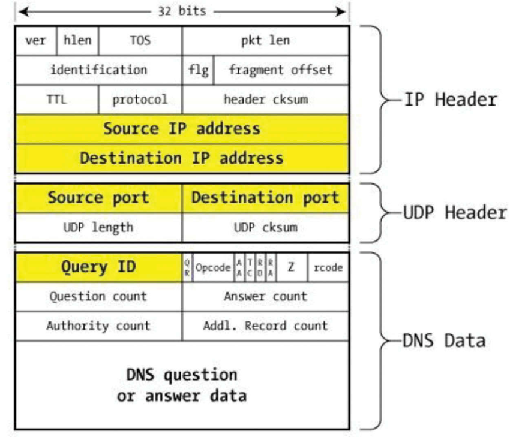

<span style="display: block; text-align: center;">*Obrázek 1: Struktura **DNS** paketu [[21]](https://www.researchgate.net/figure/DNS-packet-structure-Liu-and-Albitz-2006_fig1_334701314)*</span>

---

## 3. Sestavení a spuštění programu

### 3.1 Sestavení programu pomocí `Makefile`

Pro sestavení aplikace je k dispozici robustní `Makefile`, který nabízí celou řadu příkazů usnadňujících práci s projektem. `Makefile` podporuje dva režimy: režim **pro odevzdání** a
režim **pro vývoj**, mezi kterými lze jednoduše přepínat pomocí příkazů `make developer-mode` a `make submission-mode`. Verze pro odevzdání je minimalistická a slouží primárně k sestavení finálního
binárního souboru aplikace. Naproti tomu režim pro vývoj obsahuje rozšířené funkce, jako jsou stavba projektu pomocí **CMake**, zabalení projektu a kontrola základních požadavků na archiv a jeho obsah, 
instalace závislostí a další užitečné funkce usnadňující vývoj napříč počítači, servery či virtuálními prostředími.

Sestavení programu a jeho spuštění s výpisem nápovědy lze provést následujícím příkazem v terminálu:

```bash
make && ./dns -h
```

či jednoduše pomocí příkazu:

```bash
make run
```

`Makefile` zahrnuje základní příkazy jako:
- `make all` – výchozí příkaz sloužící k sestaví aplikaci (binárního souboru) interně využívající příkaz `make build`.
- `make help` – zobrazí seznam a popis všech dostupných příkazů `Makefile`.
- `make build` – sestavení aplikace pomocí **CMake** ve verzi pro vývoj nebo pomocí **GNU Make** ve verzi pro odevzdání.
- `make run` – spustí aplikaci s parametrem `-h` pro výpis nápovědy.
- `make test` – vytvoří a nakonfiguruje virtuální prostředí Python a spustí v něm sadu integračních testů pomocí frameworku *PyTest* (využívá k tomu skript `test/run.sh`).
- `make clean` – provede úklid generovaných souborů, rozdílný pro verzi vývojovou a odevzdávací.
- `make doc` – vygeneruje dokumentaci projektu pomocí nástroje **Doxygen** do `doc/documentation.html`.
- `make pack` – vytvoří ZIP archiv se soubory určenými pro odevzdání (pouze ve verzi pro vývoj).

Detailní popis všech dostupných příkazů naleznete v automaticky generované nápovědě mého sebedokumentujícího `Makefile`,
kterou lze získat příkazem `make help` (viz příloha [8.2](#82-výstup-příkazu-make-help))

### 3.2 Spuštění programu

Program se spouští z příkazové řádky následujícím způsobem:

```bash
./dns [-h | --help] {-s serverNameOrIp | --server serverNameOrIp } [-p port | --port port] {-f filterFile | --filter filterFile} [-v | --verbose]
```

- `-h`, `--help`: Vypíše nápovědu a ukončí program s návratovým kódem 0.

- `-s`, `--server`: Povinný parametr, který určuje adresu upstream resolveru (hostname nebo **IPv4/IPv6**), na kterou se přeposílají validní **DNS** dotazy.

- `-p`, `--port`: Volitelný parametr, který nastavuje cílový port upstream resolveru jako celé číslo v rozsahu $\left<1,\ 65535\right>$; výchozí hodnota je `53` (standardní port **DNS** pro **UDP**).

- `-f`, `--filter`: Povinný parametr, který určuje cestu k textovému souboru s pravidly filtrování (jeden záznam na řádek; přesné názvy domén i zástupné vzory ve tvari `*.domain.com`), který je načten při startu aplikace.

- `-v`, `--verbose`: Volitelný parametr, který zapne podrobné logování zpracování **UDP** komunikace, **DNS** zpráv a práce resolveru na standardní chybový výstup `STDERR`.

Vedle základních krátkých forem parametrů je možné použít i jejich dlouhé varianty nad rámec zadání, které jsou popsány výše. 
Výpis programové nápovědy si můžete prohlédnout v příloze [8.3](#83-ukázka-spuštění-programu-s-parametrem--h-pro-výpis-nápovědy)

---

## 4. Přehled architektury a struktura projektu

Celý projekt čístá dohromady téměř 70 zdrojových a hlavičkových souborů, což je důsledkem mého pokusu vytvořit kvalitní objektově orientovaná návrh.
Zdrojový kód je organizován do několika složek reprezentujících moduly aplikace s jasně vymezenou odpovědností a případně do dalších submodulů.
Domnívám se, že jsem zásady *clean code* [[2]](https://github.com/nesfit/ICS/blob/master/Lectures/Lecture_05/SOLIDni_kod.pdf) a
*single responsibility principle* [[3]](https://www.geeksforgeeks.org/single-responsibility-in-solid-design-principle/) dodržel v dostatečné
míře, aby byl kód modulární, robustní, přehledný a snadno udržovatelný.

Architektura **Filtrujícího DNS resolveru** je vrstvená a odděluje práci s transportní vrstvou **UDP** nad **IPv4** od parsování a validace **DNS** 
zpráv a od vlastní aplikační logiky filtrování, aby bylo možné udržet čisté rozhraní mezi příjmem datagramu, jeho zpracováním a odesláním odpovědi 
nebo forwardu na upstream resolver. Nejvyšší vrstva (`App`) využívá fasádu pro přístup k funkcionalitě, zatímco nižší vrstvy implementují konkrétní 
chování pro různé protokoly a potřenbné činosti (např. parsování, filtrace, forwarding, ...).

Funkce `main()` slouží k registraci modulu pro práci se signály a jejich zachytávání. Následně je řízení aplikace předáno do hlavní fasády programu 
`MainAppFacade` (modul `Facades`), který je faktickým vstupním bodem aplikace, kde dochází k inicializaci prostředků a spouštění stavového automat pro 
obsluhu příchozích datagramů. Dalším důležitým modulem je modul `DnsUtils`, který slouží na zpracování **DNS** zpráv – zajišťuje dekódování hlavičky, 
sekce dotazů a případné komprese jmen, kontrolu syntaxe a bezpečné odmítnutí neplatných konstrukcí, přičemž pravidla formátu a chování vycházejí 
z normy **RFC 1035**. Síťová část v modulu `Networking` využívá standardní socketové rozhraní pro vytváření, *bindování* a používání koncových 
bodů komunikace.

Níže je orientační popis jednotlivých adresářů (modulů) a souborů (submodulů) v projektu:
- `App`: **Hlavní vstupní bod aplikace (`main.cpp`).**
- `Arguments`: **Modul** zpracovávající parametry příkazové řádky a validující vstupní argumenty.
  - `ArgumentParser`: Třída pro validaci a parsování argumentů příkazové řádky pomocí knihovny `CLI11`.
  - `CLI11`: Knihovna třetí strany kompatibilní s licencí projektu poskytující rozhraní k parsování argumentů příkazové řádky.
  - `CommandLineOptions`: Datová třída pro uchování zvalidovaných parametrů.
- `Constants`: **Modul** konstant různých účelů využívaných napříč programem.
  - `ColorEscapeSequences`: Definuje barevné escape sekvence pro volitelné zvýraznění logů (či jiných textů).
  - `CustomLimits`: Udává interní limity jako je maximální délka jmen, maximální velikost zprávy a další číselné meze.
  - `DefaultOptions`: Obsahuje výchozí hodnoty volitelných vstupních argumentů a dalších parametrů aplikace.
  - `DnsHeaderFlagMasks`: Definuje bitové masky pro práci s příznaky **DNS** hlavičky.
  - `DnsHeaderIndexes`: Definuje indexy a posuny polí **DNS** hlavičky pro čtení z binárního bufferu.
  - `ExceptionMessages`: Sdružuje textové šablony chybových zpráv a standardizované hlášky výjimek.
- `DnsUtils`: **Modul** implementující zpracování, validaci a tvorbu **DNS** zpráv a související logiku.
  - `DnsForwarder`: Komponenta pro přeposílání validních dotazů na upstream resolver a odběr jeho odpovědí.
  - `DnsHeader`: Datová třída s pomocnými metodami pro čtení a zápis polí **DNS** hlavičky z/do binárního bufferu.
  - `DnsMessageParser`: Parser a validátor **DNS** dotazů včetně dekódování `QNAME` komprese jmen pro `QDCOUNT >= 1`.
  - `DnsMessenger`: Generátor lokálních odpovědí klientům (např. `REFUSED`, `FORMERR`, ..) a jejich odesílání.
  - `DnsQuery`: Datová třída reprezentující **DNS** dotaz s hlavičkou, otázkami a základními metadaty.
  - `DomainValidators`: Statické validační metody pro doménová jména (v souboru filtru či příchozí).
  - `Transaction`: Datová třída reprezentující rozpracovanou transakci s metadaty (časové značky, původní ID, ...).
  - `TransactionIdProvider`: Poskytovatel identifikátorů transakcí a souvisejících operací využívající generátor pseudonáhodných čísel.
- `Enums`: **Modul** výčtových typů různých účelů využívaných napříč programem.
  - `DnsOpcodes`: Výčtový typ pro hodnoty `OPCODE` v **DNS** dotazech.
  - `DnsRCodes`: Výčtový typ pro návratové kódy **DNS** (např. `NOERROR`, `FORMERR`, `REFUSED`).
  - `ExitCodes`: Standardizované návratové kódy pro úspěšné i chybné ukončení aplikace.
  - `Mapping/EnumMappers`: Šablonové mapovače pro převody výčtových typů na textovou reprezentaci a naopak.
  - `Mapping/EnumMaps`: Konkrétní mapy textových reprezentací pro podporované výčtové typy.
- `Exceptions`: **Modul** definující hierarchii výjimek pro různé typy chybových stavů.
  - `BaseCustomException`: Bázová šablonová třída výjimek schopná nést kód (libovolný typ *enumu*), chybovou zprávu a detail konkrétní chyby.
  - `CustomExceptions`: Deklarace a implementace specializovaných výjimek (např. `InternalErrorException`, `SocketErrorException`, ...).
- `Facades`: **Modul** fasád, které zapouzdřují komplexní interakce a poskytují zjednodušené rozhraní.
  - `MainAppFacade`: Centrální komponenta řídící tok aplikace a propojující ostatní části aplikace.
- `Filter`: **Modul** implementující načítání a vyhodnocování blokovacích pravidel.
  - `DomainFilter`: Logika filtrování nad přesnými záznamy i *wildcardy* (zástupnými vzory domén).
  - `FilterFileLoader`: Načítání souboru s pravidly filtrování ze souboru, jehož cesta je zadána jako vstupní parametr.
  - `FilterFilePreprocessor`: Předzpracování řádků (ořez komentářů, ořez bílých znaků, ořez prázdných řádků, normalizace).
  - `FilterFileValidator`: Kontroluje formát a obsah pravidel a detekuje neplatné záznamy.
- `HostnameResolution`: **Modul** zajišťující překlad a přípravu cílového spojení na upstream resolver.
  - `HostnameResolver`: Rezoluce jména nebo řetězce adresy upstreamu na **IPv4** adresu.
  - `ResolverSetup`: Příprava adresních struktur a parametrů pro síťovou komunikaci s upstreamem.
- `Networking`: **Modul** realizující síťovou komunikaci nad **UDP** a obsluhu příchozích datagramů.
  - `ClientJob`: Lehká jednotka práce reprezentující přijatý klientský datagram a jeho metadata.
  - `UdpFsm`: Stavový automat pro příjem **UDP** datagramů, validaci a volbu akce (odpověď/forward).
  - `UdpSockets`: Vytváří a konfiguruje standardní **UDP** sockety (jeden pro příchozí a druhý pro odchozí datagramy) a implementuje operace pro správu jejich životního cyklu.
- `Utilities`: **Modul** poskytující pomocné submoduly využívané napříč projektem.
  - `CastUtils`: Šablonové metody pro bezpečné přetypovávání mezi celočíselnými/enumerovanými typy, řetězci, vektory a poli.
  - `ExceptionHandler`: Centralizovaný zachytávač výjimek, který loguje chyby a zajišťuje korektní ukončení aplikace.
  - `Logger`: Jednoduché logovací makro pro trasování běhu a diagnostiku.
  - `RandomNumberGenerator`: Generátor náhodných čísel využitelný například pro **TXID** (ID transakcí).
  - `SignalHandler`: Registruje a obsluhuje signály procesů (např. `SIGINT`) pro řízené ukončení aplikace.
  - `StringUtils`: Pomocné metody pro práci s řetězci, normalizaci a formátování zpráv.
  - `TSQueue`: Šablonová fronta s podporou více vláken pro bezpečnou výměnu dat mezi vlákny.

Tato struktura umožňuje oddělený vývoj i testování modulů a udržuje čisté hranice mezi zpracováním **DNS** zpráv, síťovou dopravou a filtrovací logikou. 
Díky tomu lze jednotlivé části vylepšovat a ladit bez vedlejších dopadů na ostatní vrstvy.

>Pro případné zájemce o implementační detaily doporučuji vygenerovat  **Doxygen** dokumentaci pomocí příkazu
>`make doc` a prozkoumat ji (bude umístěna v `doc/documentation.html`. Obsahuje podrobnosti o třídách, metodách
>a jejich vzájemných vztazích.

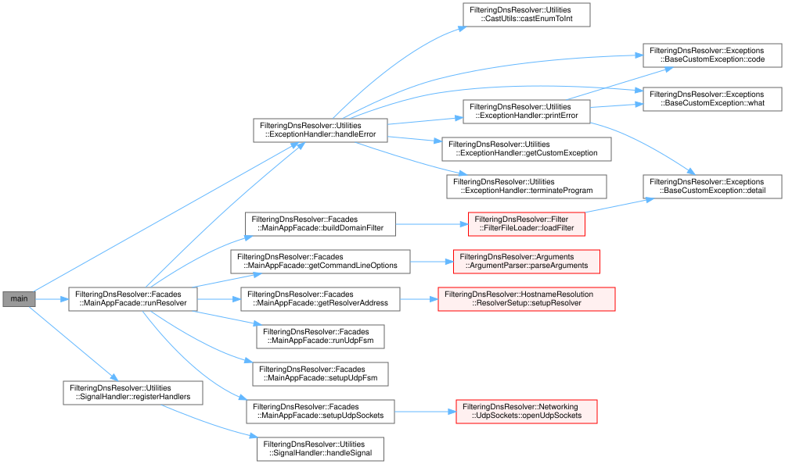

<span style="display: block; text-align: center;">*Obrázek 2: Graf volání z funkce `main()`*</span>

### 4.1 Modul `Arguments`

Parametry získané z příkazové řádky jsou uchovávány v instanci třídy `CommandLineOptions`.

Zpracování a validace vstupních argumentů probíhá prostřednictvím třídy `ArgumentParser`,
která využívá knihovnu **CLI11** [[8]](https://cliutils.github.io/CLI11/book/) pro parsování příkazové řádky.
Tuto knihovnu jsem zvolil pro její jednoduchost a přehledný manuál, díky kterému je možné rychle se s
knihovnou naučit pracovat. Současně je vedena pod **BSD licencí**, která je kompatibilní s **GNU GPLv3 licencí**
mé aplikace.

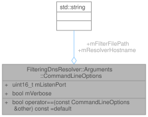

<span style="display: block; text-align: center;">*Obrázek 3: Obsah datové třídy `Arguments::CommandLineOptions`*</span>

### 4.2 Modul `DnsUtils`

Modul `DnsUtils` sdružuje datové i funkční komponenty pro dekódování, validaci, sestavování a transport **DNS** zpráv 
v podobě **UDP** datagramů, přičemž důsledně respektuje formát hlavičky, strukturu sekcí dotazu a pravidla komprese jmen 
podle **RFC 1035**. Tato sada submodulů společně pokrývá celý životní cyklus **DNS** dotazu v aplikaci, od bezpečného 
dekódování a validace přes rozhodnutí o blokaci či forwardu až po tvorbu odpovědi. 

### 4.2.1 Submoduly `DnsHeader` a `DnsQuery`

`DnsHeader` je datová třída abstrahující nejpodstatnější pole hlavičky **DNS** nutná pro korektní zpracování příchozího 
dotazu a tvorbu odpovědi. Konkrétně se jedná o identifikátor transakce `mId`, příznaky `mFlags` a počet položek v sekci 
dotazů `mQdCount`, čímž umožňuje efektivní práci s hlavičkou bez zbytečného ukládání celé struktury v případech, kdy je 
cílem filtrovat a transparentně přeposílat dotazy. Třída poskytuje přístupové metody a pomocné funkce pro čtení a zápis 
relevantních bitů a číselných polí v síťovém pořadí bajtů.

Další podstatnou datovou třídou je třída `DnsQuery`. Jde o datovou reprezentaci rozparsovaného **DNS** dotazu a nese 
informace o jednom čí více dotazech v rámci zachyceného DNS paketu – v aplikaci podporuji `QDCOUNT >= 1`. Interně 
obsahuje (jsou do ní ukládána) zejména dekódovaná doménová jména ve formě interního textového zápisu (s využitím 
separátoru tečky `.`), typ a třídu dotazů. Z pohledu aplikace abstrahuje binární formát na bezpečnou strukturu, nad níž 
lze deterministicky aplikovat filtrovací pravidla a zároveň snadno rozhodnout, zda dotaz předat upstream resolveru či 
lokálně ukončit odpovědí s příslušným návratovým kódem (např. `REFUSED`, `FORMERR`).

<div style="display: flex; justify-content: space-between; flex-wrap: nowrap; gap: 10px;">
    <div style="flex: 1; min-width: 0;">
        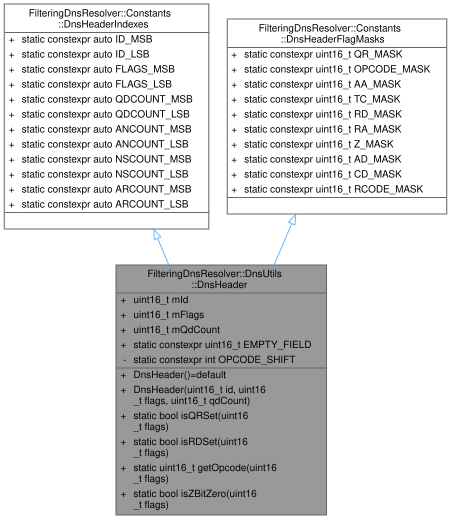
        <p style="text-align: center; margin-top: 5px;"><i>Obrázek 4: Třída <tt>DnsUtils::DnsHeader</tt></i></p>
    </div>
    <div style="flex: 1; min-width: 0;">
        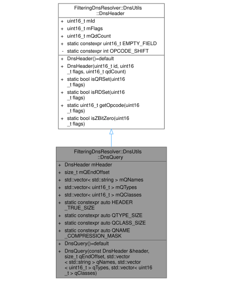
        <p style="text-align: center; margin-top: 5px;"><i>Obrázek 5: Třída <tt>DnsUtils::DnsQuery</tt></i></p>
    </div>
</div>

### 4.2.2 Submoduly `Transaction` a `TransactionIdProvider`

`Transaction` je datová třída uchovávající kontext rozpracovaného/nevyřízeného dotazu mezi klientem a upstream resolverem. 
Jejím cílem je spolehlivé propojení odpovědí z upstreamu s původním klientským dotazem. Tato třída je využívání v modulech 
`UdpFsm` a `DnsForwarder` k bezpečnému propojení příchozích a odchozích datagramů a k rozhodování o zahození expirovaných 
či nekonzistentních transakcí. Každá transakce je totiž od doby své instanciace opatřena časovou značkou, díky které lze 
detekovat překročení časového limitu a následně transakci ukončit s chybovým hlášením.

`TransactionIdProvider` je submodul, který poskytuje zdroj identifikátorů transakcí v případě, že aplikace používá 
mapování **TXID** vůči upstreamu, a to tak, aby nedocházelo ke kolizím v rámci lokální instance a aby bylo možné 
jednoznačně přiřadit návratový identifikátor zpět k původnímu klientovi. Tento submodul využívá pseudonáhodný generátor 
s 16bitovým rozsahem čísel a jednoduchou detekcí kolizí v právě otevřených transakcích. Interně si uchovává mapu právě 
používaných **TXID** a v případě opakovaného vygenerování již používané hodnoty (32 pokusů náhodné generace) začne od 
náhodné hodnoty lineárně procházet čísla z daného rozsahu, dokud nenarazí na ještě nevyužívanou hodnotu. Snažím se tedy
dodržovat všechna doporučení zmíněná na přednáškách. Z hlediska aplikace jako celku tím přispívá k robustnímu a 
deterministickému chování ve scénářích s vyšší paralelismem dotazů.

<div style="display: flex; justify-content: space-between; flex-wrap: nowrap; gap: 10px;">
    <div style="flex: 1; min-width: 0;">
        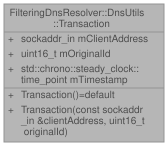
        <p style="text-align: center; margin-top: 5px;"><i>Obrázek 6: Třída <tt>DnsUtils::Transaction</tt></i></p>
    </div>
    <div style="flex: 1; min-width: 0;">
        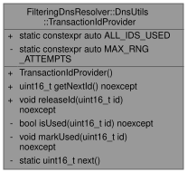
        <p style="text-align: center; margin-top: 5px;"><i>Obrázek 7: Třída <tt>DnsUtils::TransactionIdProvider</tt></i></p>
    </div>
</div>

### 4.2.3 Submoduly `DnsMessageParser` a `DomainValidators`

Submodul `DnsMessageParser` zodpovídá za bezpečné dekódování binárního **DNS** dotazu z datagramu, kontrolu minimální 
délky dotazu, ověření příznaků v hlavičce, a především za korektní dekódování doménových jmen včetně podpory komprese 
pomocí ukazatelů. Parser explicitně detekuje zakázané konstrukce, jako jsou dopředné ukazatele (*forward pointer*), 
cykly v ukazatelých a odkazy mimo rozsah zprávy, které vyhodnocuje jako syntaktickou chybu s výsledkem `FORMERR`. 
Naopak validní komprimované tvary jsou plně podporovány a vnitřně převáděny do kanonické podoby tak, aby následné 
filtrování vždy pracovalo se sémanticky totožným jménem bez ohledu na použitou kompresi – převod na *lower-case* a 
odebrání případné ukončovací (*trailing*) tečky. 

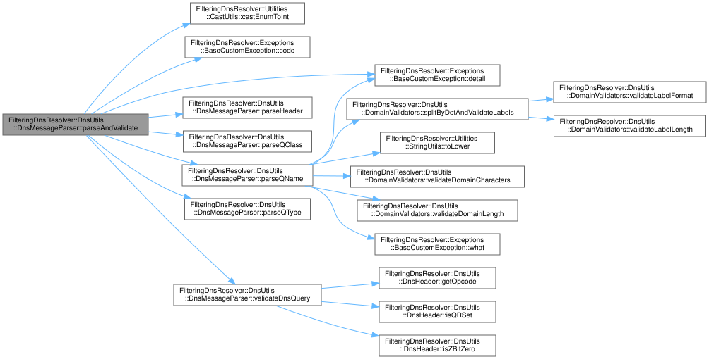

<span style="display: block; text-align: center;">*Obrázek 8: Call graph metody `DnsUtils::DnsMessageParser::parseAndValidate()`*</span>

S parserem úzce spolupracuje submodul`DomainValidators` poskytující sadu metod na kontrolu syntaxe doménových jmen a obsahu 
filtrovací souboru s blokovanými doménami. Je využíván kalidaci přesných záznamů i *wildacardů* (zástupných vzorů) s důrazem 
na délky *labelů*, povolené znaky, tečku jako oddělovač a maximální délku celého jména. Tento submodul a tak zaručuje, že 
pravidla filtru i dotazy vstupují do rozhodovací *mašinérie* ve správném a bezpečném tvaru.

Nad rámec zadáním definovaného nezbytného minima validátory podporují i vícenásobné dotazy v jedné **DNS** zprávě tak, 
aby byla zajištěna konzistentní kontrola všech položek *Question* sekce před rozhodnutím o blokaci či forwardu.

Resolver podporuje pouze dotazy s `QTYPE = 1` (`A`) a `QCLASS = 1` (`IN`). To znamená, že zpracovává výhradně požadavky 
na zjištění **IPv4** adres (záznamy typu `A` v internetové třídě) a nepodporuje ani nepřeposílá dotazy na jiné typy 
záznamů (např. `AAAA`, `MX`, `TXT`, `CNAME`) ani jiné třídy (např. `CH`, `HS`). Dotazy s jiným `QTYPE` nebo `QCLASS` 
jsou považovány za nepodporované – v `DnsMessageParseru` je vyhozena výjímka, která je následně zachycena v `UdpFsm` a 
vede k odeslání odpovědi s kódem `NOTIMP` (tedy neimplementováno). Znalosti o jednotlivých typech a třídách **DNS** dotazů 
jsem čerpal zejména z RFC 1035 – konkrétně v **kapitole 3** [[7]](https://datatracker.ietf.org/doc/html/rfc1035#section-3).

### 4.2.4 Submodul `DnsMessenger`

`DnsMessenger` je odpovědný za konstrukci a odeslání odpovědí klientovi v případech, kdy je dotaz syntakticky chybný nebo 
blokovaný filtrem. Vytváří **DNS** zprávy s nastaveným příznakem `QR=1` (tzn., že zpráva je odpovědí), správným `RCODE` a, 
pokud to situace dovoluje, vrací zpět i původní *Question* sekci. Při `FORMERR` (syntaktické chybě) zachovává identifikátor 
transakce a vrací odpověď, která jednoznačně signalizuje syntaktickou chybu, zatímco při blokaci vyplňuje `RCODE = REFUSED` 
a tím deklaruje, že jméno nebylo vyřízeno z politických důvodů filtru (jako je uvedeno v RFC 1035). Třída se současně 
stará o to, aby odpovědi respektovaly velikostní omezení **UDP** přenosu bez **EDNS(0)** rozšíření.

### 4.2.5 Submodul `DnsForwarder`

`DnsForwarder` realizuje transparentní přeposílání validních dotazů na upstream resolver a zpracování jeho odpovědí zpět 
ke klientovi tak, aby obsah zpráv zůstal nezměněn. Tento submodul se stará o odeslání datagramu. Následně čeká na odpověď 
s ohledem na nastavené časové limity (definováno konstantou `PENDING_TXS_MAX_WAIT` na dobu **5000 ms**) a při doručení 
ji propojuje s příslušnou otevřenou transakcí. Po zpětném namapování transakce `DnsForwarder` při návratu do klientské 
roviny obnoví původní ID. Přenos je navržen s ohledem na klasické omezení velikosti **DNS** zprávy 512 bajtů.

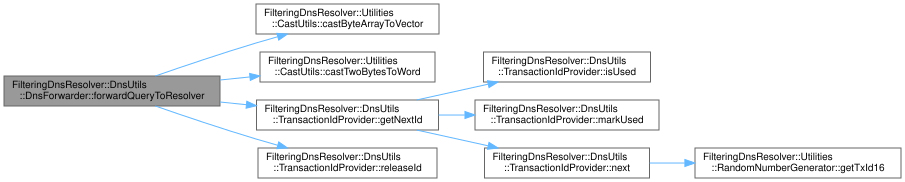

<span style="display: block; text-align: center;">*Obrázek 9: Call graph metody `DnsUtils::DnsForwarder::forwardQueryToResolver()`*</span>

### 4.3 Modul `Filter`

Modul `Filter` poskytuje funkcionalitu pro načítání, předzpracování, validaci a vyhodnocování blokovacích pravidel pro 
doménová jména tak, aby bylo možné při zpracování **DNS** dotazů rozhodnout, zda se má dotaz lokálně zamítnout, nebo 
transparentně předat na upstream resolver (*forwardovat*). Modul pracuje s kanonickými textovými tvary plně kvalifikovaných 
doménových jmen – *lower-case* a bez koncové (*trailing*) tečky, přičemž syntaxe domén a omezení délek vychází ze 
specifikace **DNS**. Z hlediska aplikace tvoří `Filter` rozhodovací bod, který jednoznačně a efektivně aplikuje sadu 
přesných položek a zástupných vzorů nad jedním či více dotazy v *Question* sekci, aniž by zasahoval do **UDP** transportu 
nebo do binárního formátu zprávy.

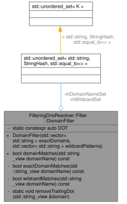

<span style="display: block; text-align: center;">*Obrázek 10: Třída `Filter::DomainFilter`*</span>

### 4.3.1 Submodul `DomainFilter`

`DomainFilter` je hlavním submodulem celého filtrovacího modulu. Obsahuje dvě hlavní kolekce pravidel – přesné domény 
v kanonickém tvaru a *wildcardy* (zástupné vzory) ve tvaru `*.example.com`. Poskytuje rozhraní pro jednoznačné vyhodnocení, 
zda je dané doménové jméno blokované. Každá přesná položka modeluje úplnou shodu s cílovým jménem po normalizaci na malá 
písmena a odstranění koncové (*trailing*) tečky. Zástupné vzory jsou vyhodnocovány jako shoda libovolného neprazdného 
počtu levých *labelů* nad konkrétním sufixem, takže `*.example.com` blokuje `a.example.com` i `a.b.example.com`, zatímco 
samotné `example.com` jako přesná položka blokuje pouze toto jméno. Tato sémantika brání neúmyslnému *požírání* sousedních 
jmenných prostorů.

`DomainFilter` je hlavním submodulem celého filtrovacího modulu. Obsahuje dvě hlavní kolekce pravidel – přesné domény 
v kanonickém tvaru a zástupné vzory (*wildcards*) ve tvaru `*.example.com`. Poskytuje rozhraní pro jednoznačné vyhodnocení, 
zda je dané doménové jméno blokované. Každá přesná položka modeluje úplnou shodu s cílovým jménem po normalizaci na malá 
písmena a odstranění koncové (*trailing*) tečky, přičemž respektuje nerozlišování velikosti písmen v **DNS**, jak je 
popsáno v **kapitole 2.3** dokumentu **RFC 1035** [[9]](https://datatracker.ietf.org/doc/html/rfc1035#section-2.3). 
Zástupné vzory jsou vyhodnocovány jako shoda libovolného neprazdného počtu levých *labelů* nad konkrétním sufixem, 
takže `*.example.com` blokuje `a.example.com` i `a.b.example.com`, zatímco `example.com` jako přesná položka blokuje 
pouze toto jméno. Tato sémantika brání neúmyslnému *požírání* sousedních jmenných prostorů. Tato sémantika je návrhově 
inspirována rolí *wildcard* jmen v **DNS** (tj. *matching* nad hierarchií jmenného prostoru) popsaných v dokumentu **RFC 1034** 
(zejména v **kapitole 4.3.3**) [[10]](https://datatracker.ietf.org/doc/html/rfc1034#section-4.3.3). Nicméně v této aplikaci 
jde výhradně o způsob rozšíření defince blokovaných domén ve filtrovacím souboru. 

Již zmiňované kolekce jsou implementovány jako `std::unordered_set<std::string, StringHash, std::equal_to<>>`, což umožňuje 
průměrnou časovou složitost vyhledání `O(1)` pro oba typy položek. Jde totiž o neseřazené množiny, ve kterých je díky hashovací
funkci možné rychle zjistit přítomnost konkrétního jména či sufixu. Konkrétně se jedná o implementaci `StringHash` jak
je popsána na blogu *EBadBlog* [[11]](https://ebadblog.com/looking-up-a-c++-hash-table-with-a-pre-known-hash).

### 4.3.2 Submodul `FilterFileLoader`

Submodul `FilterFileLoader` zodpovídá za načtení vstupního souboru s pravidly do paměti a předání jeho obsahu dalším stupňům 
zpracování. Submodul řeší otevření souboru, čtení po řádcích v očekávaném textovém kódování a kontrolu chybových stavů, jako 
je neexistující cesta k souboru nebo nedostatečná oprávnění – v těchto případech vyvolává výjimku a dojde k ukončení programu 
s chybovým návratovým kódem. 

Výstupem `FilterFileLoader` je surový seznam (`std::vector<std::string>`) textových řádků připravených pro předzpracování bez 
jakékoli interpretace syntaxe domén nebo *wildcardů*, což udržuje čistou separaci odpovědností.

### 4.3.3 Submodul `FilterFilePreprocessor`

`FilterFilePreprocessor` převádí surový obsah souboru s pravidly na normalizovanou podobu vhodnou pro validaci a následné 
uložení do `DomainFilter`. Provádí odstranění prázdných řádků, odstranění komentářů a ořezání počátečních a koncových bílých 
znaků (podpuruje konce řádku používané v systémech Linux, Windows i MacOS), normalizaci velikosti písmen na malá písmena 
(*lower-case*) a volitelně odstranění koncové tečky, aby jména byla ve stejném kanonickém tvaru jako jména vzniklá 
parsováním **DNS** dotazu (popsáno v **RFC 4343** [[12]](https://datatracker.ietf.org/doc/html/rfc4343)). Komentáře jsou 
brány jako text za stanoveným oddělovačem na řádku `#` a nejsou dále zpracovávány, čímž je zajištěno, že konfigurace může 
být srozumitelně anotována, aniž by to ovlivnilo běh aplikace. Preprocesor přitom neinterpretuje syntaxi domén ani 
*wildcardů* a nezohledňuje duplicitní výskyty; jeho úkolem je poskytnout čistý a jednotně normalizovaný vstup pro 
validační krok a následné uložení.

### 4.3.4 Submodul `FilterFileValidator`

`FilterFileValidator` provádí syntaktickou a sémantickou kontrolu jednotlivých položek po předzpracování a rozhoduje, zda 
jde o validní přesnou doménu, validní *wildcard*, nebo chybný záznam, který má být odmítnut s popisem problému (v režimu 
**verbose**). Využívá pravidel pro doménová jména definovaná v **RFC 1035** a kontroluje zejména povolené znaky v *labelech*, 
jejich délku do 63 oktetů a maximální délku celého jména do 253 oktetů, stejně jako přítomnost oddělovače tečka mezi *labely*. 
Pro *wildcardy* prosazuje sémantiku jediného levostranného `*.` před sufixem, čímž zakazuje vzory s hvězdičkou uvnitř *labelu* 
nebo vícenásobné hvězdičky, a tím brání nejednoznačnostem a těžko předvídatelnému chování. 

Submodul dále dokáže eliminovat duplicitní položky a v případě konfliktu mezi přesnou položkou a jejím nadřazeným *wildcardem* 
zachovává obě deklarace, protože jejich aplikace závisí na přesné shodě vstupního jména a je deterministická. Z pohledu 
aplikace plní `FilterFileValidator` klíčovou roli bezpečnostní brány, tzn. nepustí do běhu nekorektní nebo *vágně* zadaná 
pravidla a garantuje, že `DomainFilter` bude pracovat pouze se sémanticky jasně definovanou množinou záznamů.


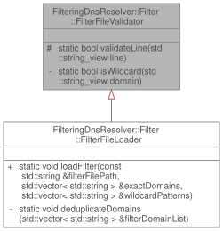

<span style="display: block; text-align: center;">*Obrázek 11: Třída `Filter::FilterFileValidator`*</span>

### 4.4 Modul `HostnameResolution`

Třída `HostnameResolver` je zodpovědná za převod zadaného hostitelského jména (_hostname_) nebo **IPv4/IPv6** adresy na 
adresu serveru (*hostname* či **IP** adresa je předány uživatelem za parametrem `-s`). Pomocí funkce `getaddrinfo()` 
[[13]](https://man7.org/linux/man-pages/man3/getaddrinfo.3.html) získává tato třída jak **IPv4**, tak i **IPv6** adresu, 
kterou následně převádí na lidem čitelný řetězec. Pokud dojde při volání `getaddrinfo()` [[13]](https://man7.org/linux/man-pages/man3/getaddrinfo.3.html)
k chybě, je vyvolána příslušná výjimka, která upozorní na problém s rezolucí hostitelského jména, což vede
na ukončení programu s chybovým návratovým kódem.

### 4.5 Modul `Networking`

Modul `Networking` tvoří běhové jádro aplikace zodpovědné za práci s **UDP** sokety v prostředí **IPv4**, za řízení příjmu 
a odesílání datagramů a za řízení zpracování **DNS** dotazů včetně rozhodnutí, zda odpovědět lokálně, nebo *forwardovat* 
na upstream resolver. Modul je navržen tak, aby striktně odděloval síťovou vstupně-výstupní logiku od logiky parsování a 
filtrování. Do **DNS** zpráv jako takových tento modul nikdy nezasahuje a ponechává jejich interpretaci zpracování na 
modulu `DnsUtils`.

### 4.5.1 Submodul `UdpSockets`

`UdpSockets` je třídou zastřešující dvojici socketů – *naslouchacího* socketu přijímajícího klientské dotazy a *resolver* 
socketu starajícího se o odesílání datagramů směrem k upstream resolveru. Poskytuje metody na jejich vytvoření, nastavení 
a celkovou správu jejich životního cyklu. Nese deskriptory obou socketů a adresní struktury včetně portů. Poskytuje bezpečné 
volání pro standardní funkce `bind` [[14]](https://man7.org/linux/man-pages/man3/bind.3p.html), 
`recvfrom` [[15]](https://man7.org/linux/man-pages/man3/recvfrom.3p.html) a `sendto` [[16]](https://man7.org/linux/man-pages/man3/sendto.3p.html).

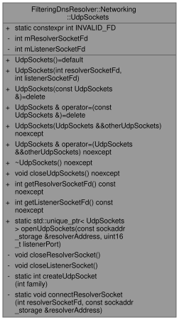

<span style="display: block; text-align: center;">*Obrázek 12: Třída `Networking::UdpSockets`*</span>

### 4.5.2 Submodul `UdpFsm`

Submodul `UdpFsm` je srdcem celého programu. Jde o submodul řídící veškerý síťový provoz v této aplikaci. Spojuje přijímací 
a odesílací fázi **UDP** komunikace s parsováním, filtrováním a *forwardováním* **DNS** dotazů a který řídí více zároveň 
běžících smyček (vláken) tak, aby aplikace bezpečně a rychle pracovala i pod větší zátěží.

Submodul se skládá ze dvou hlavních vstupně-výstupních smyček. `listenerLoop()` slouží pro příjem klientských datagramů a 
`resolverLoop()` slouží pro obsluhu odpovědí z upstreamu. Pro rozdělení jsem se rozhodl, jelikož v praxi jde o nezávislé 
zdroje událostí, které není vhodné míchat do jediné blokující operace – což umožní paralelizaci a zrychlení celé aplikace. 
Obě smyčky využívají `poll()` [[17]](https://man7.org/linux/man-pages/man3/poll.3p.html) a sdílejí pouze minimální stav 
nutný pro propojení dotazu s odpovědí. Sdílený stav představuje především fronta otevřených transakcí, které mapují 
klientskou adresu, port a **TXID** na kontext předaný `DnsForwarderu`. `UdpFsm` používá v tomto úzkém kritickém úseku 
zámkem při vkládání, vyhledávání a mazání položek, přičemž samotné volání `recvfrom` [[15]](https://man7.org/linux/man-pages/man3/recvfrom.3p.html) 
a `sendto` [[16]](https://man7.org/linux/man-pages/man3/sendto.3p.html) probíhají mimo zámek, aby se minimalizovala latence 
a zabránilo se zbytečnému blokování.

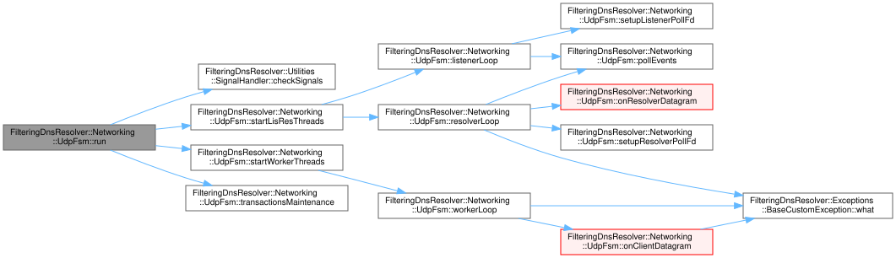

<span style="display: block; text-align: center;">*Obrázek 13: Call graph třídy `Networking::UdpFsm`*</span>

Vstupní smyčka `listenerLoop()` využívá `poll()` [[17]](https://man7.org/linux/man-pages/man3/poll.3p.html) nad naslouchacím 
soketem a čeká na příchozí datagramy. Po jejich přijetí vytvoří instaci třídy `ClientJob` a předá úlohu dál ke zpracování 
do pracovních smyček.

Interní `workerLoop()` nejprve zavolá metodu `DnsMessageParser::parseAndValidate()`, která bezpečně dekóduje hlavičku, 
zkontroluje příznaky a počítadla a rozbalí doménová jména včetně komprese s detekcí dopředných ukazatelů, smyček a odkazů
mimo rozsah. V případě chyby okamžitě volá `DnsMessenger` k vytvoření a odeslání odpovědi s `RCODE = FORMERR` zpět na 
zdrojovou adresu. Je-li zpráva syntakticky v pořádku, výsledná kanonická jména z `DnsQuery` jsou předána modulu `DomainFilter`, 
který rozhodne, zda je dotaz povolen či blokován – jelikož `QDCOUNT > 1` je nad rámec zadání, uvažuji zjednodušenně, že 
pokud je v dotazu blokována alespoň jedna doména, tak odesílám `REFUSED` na celý dotaz. Při blokaci `UdpFsm` synchronně 
požádá `DnsMessenger` o odpověď s `RCODE = REFUSED`, která respektuje kontext původní hlavičky a pokud možno vrací i 
původní *Question* sekci. V případě, že dotaz není blokován, `UdpFsm` rozhodne o *forwardu*, a to voláním `DnsForwarder`, 
který odešle datagram na upstream resolver a čeká na odpověď s ohledem na nastavené časové limity.

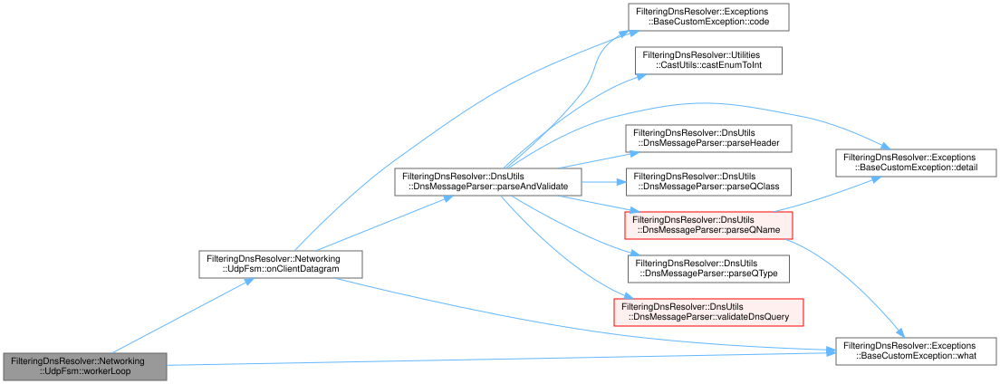

<span style="display: block; text-align: center;">*Obrázek 14: Call graph v rámci pracovních vláken `Networking::UdpFsm::WorkerLoop()`*</span>

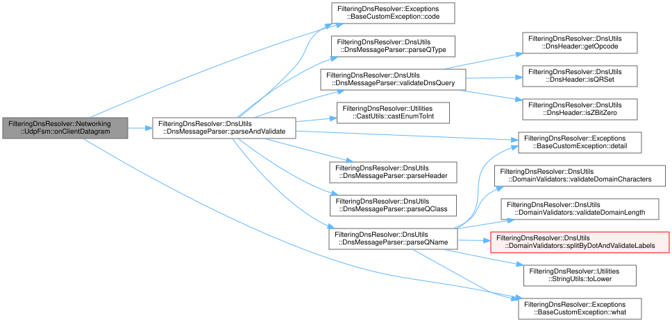

<span style="display: block; text-align: center;">*Obrázek 15: Call graph v rámci metody `Networking::UdpFsm::OnClientDatagram()`*</span>

Zvláštní roli hraje v submodulu `UdpFsm` periodická údržbová (*maintenance*) fáze řízená časovým *timestampem* (známkou).
Během údržby se pravidelně odstraňují expirované transakce, čímž se zabrání nárůstu obsazené paměti při problémech se sítí.

### 4.6 Modul `Exceptions`

Modul `Exceptions` definuje hierarchii vlastních výjimek pro jednotné a srozumitelné ohlašování chyb napříč aplikací, přičemž 
bázová šablona `BaseCustomException<EnumType>` nese kód chyby, stručnou zprávu a detail chyby. Z této bázové šablonové 
třídy následně dědí specializované třídy výjímek pokrývají interní chyby, chyby parsování **DNS** zpráv, chyby konfigurace 
filtru a síťové chyby při práci s **UDP** sokety atd.

### 4.7 Modul `Utilities`

#### 4.7.1 Submodul `ExceptionHandler`

Submodul `ExceptionHandler` zodpovídá za zachytávání, formátování a tisk výjimek (chybových stavů).
Obsahuje metody pro detekci a rozlišení typu výjimky, tisknutí detailních zpráv o chybách včetně
chybových kódů a zajištění řízeného ukončení programu.

#### 4.7.2 Submodul `RandomNumberGenerator`

Submodul `RandomNumberGenerator` poskytuje metody generující náhodná čísla určená pro síťové operace.
Mezi nejdůležitější funkce patří generování 16-bitových **TXID** v rozsahu $\left<0,\ 65535\right>$.
Používá generátor _Mersenne Twister_ [[18]](https://en.wikipedia.org/wiki/Mersenne_Twister) pro dosažení kvalitního
a rovnoměrného rozložení hodnot. Tento generátor jsem si vybral jelikož je standardní součástí **C++** od **C++11**
a produkoval mi dostatečně náhodná čísla pro účely generování transakčních ID.

#### 4.7.3 Submodul `SignalHandler`

Submodul `SignalHandler` řeší zachytávání a zpracování systémových signálů, resp. signálu `SIGINT`, kterým
může uživatel v libovolný okamžik ukončit běh aplikace pomocí klávesové zkratky **CTRL+C**. Po zachycení
signálu generuje příslušnou výjimku.

#### 4.7.4 Submodul `TSQueue`

`TSQueue` je jednoduchá bezpečná fronta pro předávání úloh mezi naslouchací smyčkou a pracovními vlákny. Poskytuje 
blokující `push`/`pop` operace. Díky této frontě je možné v rámci `UdpFsm` oddělit přijímací logiku od zpracovatelské a 
umožnit tak paralelní vícevláknové zpracování bez rizika vzniku *race conditions* při přístupu ke sdílenýmu zdroje 
v podobě této fronty. Moje implementace byla inspirována článek na webu *Medium* od autora 
*Xina* [[19]](https://medium.com/@lixin_78505/c-implementing-a-simple-thread-safe-queue-b0cdfec40e71).

### 4.8 Modul `Facades`

`MainClientFacade` je hlavní fasádou aplikace [[20]](https://en.wikipedia.org/wiki/Facade_pattern). Je instanciována ve 
funkci `main()` a následně je pomocí jediného příkazu `appFacade.runResolver(argc, argv)` zahájen samotný běh aplikace. 

Jejím úkolem je:
- zpracování příkazových argumentů pomocí třídy `ArgumentParser`,
- rezoluce zadaného hostitelského jména či **IP** adresy serveru pomocí třídy `HostnameResolver`,
- načtení, předzpracování a validace blokovacích pravidel ze souboru pomocí modulu `Filter`,
- vytvoření a nastavení **UDP** socketů pro komunikaci s klienty a upstream resolverem pomocí třídy `UdpSockets`,
- spuštění běhu FSM pomocí volání jediné veřejné metody jejího rozhraní `mUdpFsmPtr->run()`,
- zachycení výjimek a jejich zpracování pomocí třídy `ExceptionHandler`.

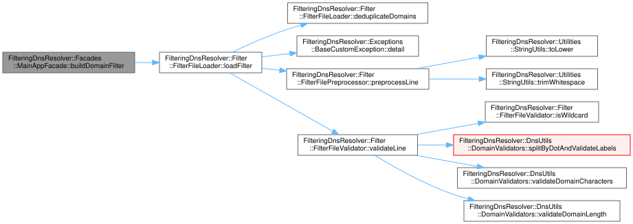

<span style="display: block; text-align: center;">*Obrázek 15: Call graph třídy `Facades::MainAppFacade`*</span>

### 4.9 Modul `App`

Nakonec je zde modul `App`, který obsahuje vstupní bod aplikace v podobě souboru `main.cpp`. Jeho implementace je
minimalistická – registruje signálové *handlery*, vytváří instanci třídy `MainAppFacade`. Dále  invokuje metodu 
`appFacade.runResolver(argc, argv)` čímž rozbíhá *kolesa* mého programu. Celý tento proces je zabalený do bloku `try-catch` –
jde pouze *good-practice*, protože všechny výjimky by měly být zachyceny v rámci fasády (rád se ale držím hesla 
*"Better Sure Than Sorry."*).

---

## 5. Testování a verifikace funkčnosti

### 5.1 Testovací prostředí

- **Operační systém**: Windows 11 WSL Ubuntu 24.04.3 LTS
- **Standard C++**: verze C++20
- **Překladač**: g++ verze 14.2.0
- **Knihovna `CLI11`**: verze 2.5.0
- **Testovací framework**: Python 3.11.13 s knihovnou `pytest` verze 8.4.2

*Obsah souboru `test/IntegrationTests/requirements.txt` pro testovací prostředí:*
```plaintext
pytest>=7.0.0
scapy>=2.4.5
asyncio-dgram>=2.1.2
dnspython>=2.3.0
pytest-asyncio>=0.21.0
pytest-timeout>=2.1.0
colorama>=0.4.6
psutil>=7.1.0
```

### 5.2 Integrační testování pomocí *PyTest*

Integrační testy ověřují celkový běh aplikace od přijetí **UDP** datagramu přes parsování **DNS** zprávy, vyhodnocení 
filtru a generování lokální odpovědi až po *forwardování* na upstream, a to na skutečných soketech v prostředí **IPv4**. 
Testovací framework i testy samotné vznikly s výraznou asistencí od ChatGPT 5. Jednotlivé test-case byly vytvořeny na základě
mých přesných požadavků na jejich průběh.

Testovací *fixtures* zajišťují reprodukovatelné spuštění, pevné porty, filtrovací soubor a časové limity, takže změny
v implementaci lze spolehlivě posuzovat proti stabilní referenci. Scénáře běží na reálných **UDP** soketech.

*Struktura testovacího adresáře je následující:*
<pre>
&thinsp;📁
 └── 📁&thinsp;<b>test</b>
      ├── 📁&thinsp;<b>IntegrationTests</b>
      │    ├── 📄&thinsp;BasicFunctionalityTest.py
      │    ├── 📄&thinsp;ComplexFunctionalityTest.py
      │    ├── 📄&thinsp;CompressedNamesTest.py
      │    ├── 📄&thinsp;conftest.py
      │    ├── 📄&thinsp;DnsClient.py
      │    ├── 📄&thinsp;ErrorHandlingTest.py
      │    ├── 📄&thinsp;requirements.txt
      │    └── 📄&thinsp;ResolverManager.py
      ├── 📄&thinsp;filter.txt
      ├── 📄&thinsp;run.sh
      └── 📄&thinsp;serverlist.php
</pre>

Základní testy (`BasicFunctionalityTest.py`) ověřují formát hlavičky a sekce dotazů včetně minimálních délek, příznaku **QR**, 
konzistence počítadel a vícenásobných otázek. Ověřujeí, že syntaktické chyby musí vyústit v odeslání `FORMERR` zatímco 
syntakticky platné dotazy postupují dál. 

V souboru `CompressedNamesTest.py` se zabývám prací s komprimovanými **QNAME**. Ověřuji, že jsou v programu korektně 
dekódovany a že jsou korektně indetifikovány dopředné ukazatele, cykly a odkazy mimo rozsah a že vedou na `FORMERR`, 
a to bez pádu či ukočení aplikace.

Filtr je testován napříč testovacími soubory na přesných shodách i zástupných vzorech `*.example.com`, včetně pokročilých 
případů vyžadujících normalizace velikosti písmen a kanonického tvaru jména. Kontroluji, že při blokaci je odesílán 
`RCODE = REFUSED` a že se povolené dotazy *forwardují* beze změny.

V `ComplexFunctionalityTest.py` testuji, jak velkou zátež moje aplikace zvládne. Obsažené testovací scénáře míchají blokované,
povolené i chybné dotazy a ověřují funkčnost mého vícevláknového návrhu `UdpFsm`, správné propojování transakcí a 
stabilitu pod zátěží. `ComplexFunctionalityTest.py` simuluje dávkové vlny, plynulý proud s náhodnými časovými odchylkami 
a krátké *rapid-fire bursty*, doplněné dlouhoběžným scénářem. V scénaři jsou míchány povolené, blokované i úmyslně chybné 
**DNS** dotazy, jak jsem již zmiňoval dříve.

### 5.3 Ukázkový testovací filtr

*Obsah souboru `test/filter.txt`, jehož obsah je interně používán v integračních testech:*

```plaintext
### EXACT DOMAINS ###
# Komentář v sekci
blocked-domain.com

# Prázdný řádek
UPPERCASE-DOMAIN.COM
mixed-Case.Example.Org

# Domény s čísly a pomlčkami
test-123.numeric-domain.com
domain-with-many-dashes-and-numbers-123-456.com

# Velmi dlouhé jméno
this-is-a-very-long-domain-name-that-tests-parsing-limits.super-long-tld.example.com

# Edge cases které by měly být validovány
single.com
a.b
very.deep.subdomain.with.many.labels.example.com

### WILDCARD PATTERNS ###
*.wildcard-test.net
*.ads.tracker.com
*.malware.example.org

# Case variations
*.UpperCase.Wild.Com
*.MiXeD-cAsE.test

# Wildcard s čísly
*.tracker-123.analytics.net

### NEVALIDNÍ DOMÉNY BY MĚLY BÝT IGNOROVÁNY ###
# Neplatný znak v doméně (vykřičník, zavináč, podtržítko, mezera)
exam!ple.com
invalid@domain.com
examp_le.com
exam ple.com

# Více po sobě jdoucích teček
example..com
..example.com
example.com..

# Prázdný label na začátku nebo na konci (tečka na začátku nebo na konci)
.example.com
example.com.

# Doména delší než 253 znaků
aaaaaaaaaaaaaaaaaaaaaaaaaaaaaaaaaaaaaaaaaaaaaaaaaaaaaaaaaaaaaaaa.bbbbbbbbbbbbbbbbbbbbbbbbbbbbbbbbbbbbbbbbbbbbbbbbbbbbbbbbbbbbbbbb.cccccccccccccccccccccccccccccccccccccccccccccccccccccccccccccccc.dddddddddddddddddddddddddddddddddddddddddddddddddddddddddddddddd.com

# Label delší než 63 znaků
aaaaaaaaaaaaaaaaaaaaaaaaaaaaaaaaaaaaaaaaaaaaaaaaaaaaaaaaaaaaaaaa.com

# Label začíná nebo končí pomlčkou
-example.com
example-.com
-invalid-.com

# Komentář na konci

```

### 5.4 Zobrazení základní funkcionality i za pomoci Wiresharku

#### 5.4.1 Forwardování povolených dotazů

*Spuštění mého programu:*

```bash
./dns -s 8.8.8.8 -p 5300 -f ./test/filter.txt -v
```

*Odeslání povoleného dotazu k forwardování pomocí `dig`:*

```bash
dig +noedns @127.0.0.1 -p 5300 allowed.example A
```

*Alternativně lze použít například tento integrační test:*

```bash
myenv/bin/python -m pytest --tb=short -v IntegrationTests/BasicFunctionalityTest.py::TestBasicFunctionality::test_allowed_domain_forwarded
```

V tomto testu testuji, že povolený dotaz je správně *forwardován* na upstream resolver beze změny. Respektive dokazuji, 
že klientský dotaz je odeslán mému filtrujícímu resolveru, ten povolený dotaz forwarduje na upstream resolver, který 
zasílám mému programu odpověď, kterou nakonec přeposílám zpět původnímu klientovi. Testuji také, že při komunikaci mezi 
mým programem a upstream resolverem dochází ke změně **TXID**, které je následně namapováno zpět na původní **TXID** klienta.

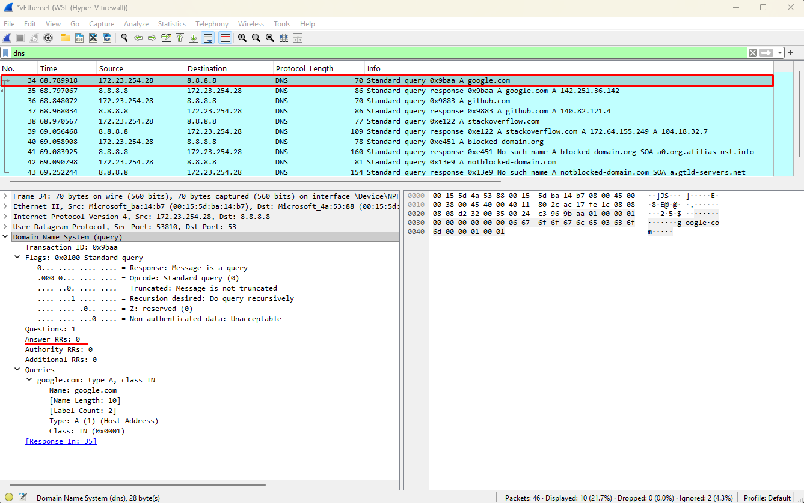

<span style="display: block; text-align: center;">*Obrázek 17: Ukázka forwardování povolených domén – forwarding dotazu na upstream resolver`*</span>

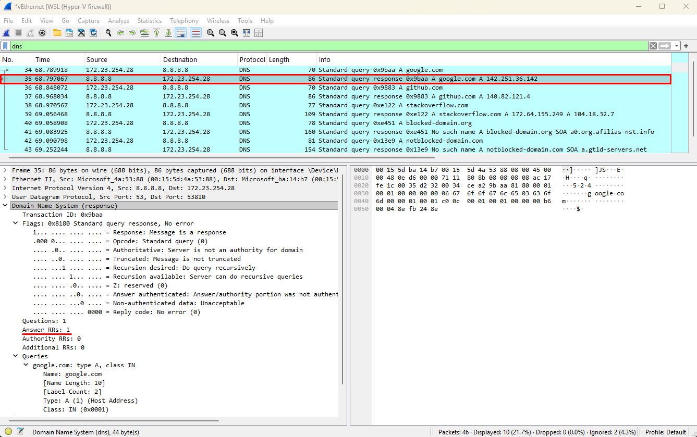

<span style="display: block; text-align: center;">*Obrázek 18: Ukázka forwardování povolených domén – odpověď z upstream resolveru*</span>

Bohužel ve Wiresahrku jsou viditelné pouze dva pakety – forwarding na upstream a odpověď z upstreamu. Komunikace mezi 
klientem a mým programem bohužel není zachytávána. Důkazem správné funkčnosti je tedy analýza logovacího výstupu mého programu:

> Fialově jsou označeny vývojárské logy a modře logy režimu **verbose** (parametr `-v`).

<pre>
...
<span style="color: rebeccapurple;">src/Networking/UdpSockets.cpp      :86   |                 openUdpSockets | Creating listener socket</span>
<span style="color: rebeccapurple;">src/Networking/UdpSockets.cpp      :235  |                createUdpSocket | Creating UDP socket with socket(AF_INET, SOCK_DGRAM, 0)</span>
<span style="color: rebeccapurple;">src/Networking/UdpSockets.cpp      :237  |                createUdpSocket | socket() returned fd=3</span>
<span style="color: rebeccapurple;">src/Networking/UdpSockets.cpp      :88   |                 openUdpSockets | Listener socket creation result: fd=3</span>
<span style="color: rebeccapurple;">src/Networking/UdpSockets.cpp      :102  |                 openUdpSockets | Setting socket options for address reuse</span>
<span style="color: rebeccapurple;">src/Networking/UdpSockets.cpp      :115  |                 openUdpSockets | Socket options set successfully</span>
<span style="color: rebeccapurple;">src/Networking/UdpSockets.cpp      :118  |                 openUdpSockets | Binding listener socket to port 5300</span>
<span style="color: rebeccapurple;">src/Networking/UdpSockets.cpp      :135  |                 openUdpSockets | Listener socket bound successfully to 0.0.0.0:5300</span>
<span style="color: rebeccapurple;">src/Networking/UdpSockets.cpp      :138  |                 openUdpSockets | Creating resolver socket</span>
<span style="color: rebeccapurple;">src/Networking/UdpSockets.cpp      :235  |                createUdpSocket | Creating UDP socket with socket(AF_INET, SOCK_DGRAM, 0)</span>
<span style="color: rebeccapurple;">src/Networking/UdpSockets.cpp      :237  |                createUdpSocket | socket() returned fd=4</span>
<span style="color: rebeccapurple;">src/Networking/UdpSockets.cpp      :140  |                 openUdpSockets | Resolver socket creation result: fd=4</span>
<span style="color: rebeccapurple;">src/Networking/UdpSockets.cpp      :153  |                 openUdpSockets | Connecting resolver socket to upstream DNS server</span>
<span style="color: rebeccapurple;">src/Networking/UdpSockets.cpp      :174  |          connectResolverSocket | Connecting resolver socket to IPv4 DNS server 8.8.8.8:53</span>
<span style="color: deepskyblue;">src/Networking/UdpSockets.cpp      :175  |          connectResolverSocket | Establishing connection to IPv4 DNS server 8.8.8.8:53</span>
<span style="color: rebeccapurple;">src/Networking/UdpSockets.cpp      :215  |          connectResolverSocket | Resolver socket successfully connected to DNS server 8.8.8.8:53</span>
<span style="color: deepskyblue;">src/Networking/UdpSockets.cpp      :216  |          connectResolverSocket | Connection to DNS server 8.8.8.8:53 established successfully</span>
<span style="color: rebeccapurple;">src/Networking/UdpSockets.cpp      :155  |                 openUdpSockets | Upstream DNS resolver connected successfully</span>
<span style="color: rebeccapurple;">src/Networking/UdpSockets.cpp      :157  |                 openUdpSockets | UDP sockets created successfully: listenerFd=3, resolverFd=4</span>
<span style="color: deepskyblue;">src/Networking/UdpSockets.cpp      :159  |                 openUdpSockets | DNS server ready on port 5300</span>
...
<span style="color: rebeccapurple;">src/Networking/UdpFsm.cpp          :336  |                   listenerLoop | listenerLoop(): received 33 bytes from client 127.0.0.1:34674</span>
<span style="color: rebeccapurple;">src/Networking/UdpFsm.cpp          :350  |                   listenerLoop | listenerLoop(): enqueued job (approx queue size before=0, after~=1)</span>
<span style="color: rebeccapurple;">src/Networking/UdpFsm.cpp          :322  |                   listenerLoop | listenerLoop(): buffer drained after 1 enqueued packets</span>
<span style="color: rebeccapurple;">src/Networking/UdpFsm.cpp          :250  |                     workerLoop | workerLoop(): worker #2 picked job: 33 bytes from 127.0.0.1:34674 (queue size approx=0)</span>
<span style="color: rebeccapurple;">src/Networking/UdpFsm.cpp          :440  |               onClientDatagram | Processing client datagram from 127.0.0.1:34674 (33 bytes)</span>
<span style="color: rebeccapurple;">src/DnsUtils/DnsMessageParser.cpp  :52   |               parseAndValidate | DnsMessageParser::parseAndValidate() called with buffer=0x780d771fcc30, length=33 bytes</span>
<span style="color: deepskyblue;">src/DnsUtils/DnsMessageParser.cpp  :54   |               parseAndValidate | Parsing incoming DNS query message (33 bytes)</span>
...
<span style="color: rebeccapurple;">src/DnsUtils/DnsMessageParser.cpp  :133  |               parseAndValidate | Creating DnsQuery object with parsed data (may be partial if errors occurred)</span>
<span style="color: rebeccapurple;">src/DnsUtils/DnsQuery.cpp          :68   |                       DnsQuery |   QNAMES: [allowed.example] (count=1)</span>
<span style="color: rebeccapurple;">src/DnsUtils/DnsQuery.cpp          :69   |                       DnsQuery |   QTYPES: [1]</span>
<span style="color: rebeccapurple;">src/DnsUtils/DnsQuery.cpp          :70   |                       DnsQuery |   QCLASSES: [1]</span>
<span style="color: deepskyblue;">src/DnsUtils/DnsQuery.cpp          :71   |                       DnsQuery | DNS query object created for domains [allowed.example] (types [1], classes [1])</span>
<span style="color: rebeccapurple;">src/DnsUtils/DnsQuery.cpp          :74   |                       DnsQuery | DnsQuery object successfully constructed</span>
...
<span style="color: deepskyblue;">src/DnsUtils/DnsMessageParser.cpp  :142  |               parseAndValidate | DNS query validation passed - query type(s) = 1, class(es) = 1</span>
...
<span style="color: deepskyblue;">src/Filter/DomainFilter.cpp        :110  |                  domainMatches | Domain 'allowed.example' allowed through filter</span>
<span style="color: rebeccapurple;">src/Networking/UdpFsm.cpp          :517  |               onClientDatagram | Domain 'allowed.example' is allowed (qtype=1, qclass=1)</span>
<span style="color: rebeccapurple;">src/Networking/UdpFsm.cpp          :529  |               onClientDatagram | Domain(s) 'allowed.example' allowed, forwarding to upstream resolver</span>
<span style="color: deepskyblue;">src/Networking/UdpFsm.cpp          :530  |               onClientDatagram | Forwarding query for allowed domain(s): allowed.example</span>
...
<span style="color: deepskyblue;">src/DnsUtils/TransactionIdProvider.cpp:62   |                      getNextId | Allocated transaction ID 33737 for new DNS query</span>
...
<span style="color: rebeccapurple;">src/DnsUtils/DnsForwarder.cpp      :105  |         forwardQueryToResolver | Creating transaction mapping: newId=33737 -> originalId=50589, client=127.0.0.1:34674</span>
<span style="color: rebeccapurple;">src/DnsUtils/Transaction.cpp       :41   |                    Transaction | Transaction::Transaction() constructor called with parameters:</span>
<span style="color: rebeccapurple;">src/DnsUtils/Transaction.cpp       :42   |                    Transaction |   Client address: 127.0.0.1:34674</span>
<span style="color: rebeccapurple;">src/DnsUtils/Transaction.cpp       :43   |                    Transaction |   Original transaction ID: 50589 (0xC59D)</span>
<span style="color: rebeccapurple;">src/DnsUtils/Transaction.cpp       :44   |                    Transaction |   Timestamp: 114172474239074 nanoseconds since epoch</span>
<span style="color: deepskyblue;">src/DnsUtils/Transaction.cpp       :46   |                    Transaction | Created DNS transaction for client 127.0.0.1:34674 (ID: 50589)</span>
<span style="color: rebeccapurple;">src/DnsUtils/Transaction.cpp       :49   |                    Transaction | Transaction object successfully constructed</span>
<span style="color: rebeccapurple;">src/DnsUtils/DnsForwarder.cpp      :108  |         forwardQueryToResolver | Transaction stored in pending map, total pending transactions: 1</span>
<span style="color: rebeccapurple;">src/DnsUtils/DnsForwarder.cpp      :111  |         forwardQueryToResolver | Sending DNS query to upstream resolver via socket FD=4, size=33 bytes</span>
<span style="color: rebeccapurple;">src/DnsUtils/DnsForwarder.cpp      :145  |         forwardQueryToResolver | DNS query forwarded successfully: originalId=50589 -> newId=33737, bytes sent=33/33</span>
<span style="color: deepskyblue;">src/DnsUtils/DnsForwarder.cpp      :147  |         forwardQueryToResolver | DNS query forwarded to upstream resolver</span>
...
<span style="color: rebeccapurple;">src/Networking/UdpFsm.cpp          :408  |                   resolverLoop | resolverLoop(): received 108 bytes from upstream resolver (packet #1)</span>
<span style="color: rebeccapurple;">src/Networking/UdpFsm.cpp          :540  |             onResolverDatagram | Processing resolver response (108 bytes)</span>
<span style="color: rebeccapurple;">src/DnsUtils/DnsForwarder.cpp      :153  |        mapResponseFromResolver | DnsForwarder::mapResponseFromResolver() called with messageLength=108 bytes</span>
<span style="color: rebeccapurple;">src/DnsUtils/DnsForwarder.cpp      :169  |        mapResponseFromResolver | Response length validation passed: 108 bytes</span>
<span style="color: rebeccapurple;">src/DnsUtils/DnsForwarder.cpp      :172  |        mapResponseFromResolver | Extracting transaction ID from DNS response</span>
<span style="color: rebeccapurple;">src/DnsUtils/DnsForwarder.cpp      :175  |        mapResponseFromResolver | Extracted response transaction ID: 33737 (0x83C9)</span>
<span style="color: rebeccapurple;">src/DnsUtils/DnsForwarder.cpp      :179  |        mapResponseFromResolver | Looking up transaction mapping for ID=33737 in 1 pending transactions</span>
<span style="color: rebeccapurple;">src/DnsUtils/DnsForwarder.cpp      :188  |        mapResponseFromResolver | Transaction mapping found: responseId=33737 -> originalId=50589, client=127.0.0.1:34674</span>
<span style="color: rebeccapurple;">src/DnsUtils/DnsForwarder.cpp      :195  |        mapResponseFromResolver | Restoring original transaction ID in response header: 33737 -> 50589</span>
<span style="color: rebeccapurple;">src/DnsUtils/DnsForwarder.cpp      :200  |        mapResponseFromResolver | DNS response header updated with original ID: 50589</span>
<span style="color: rebeccapurple;">src/DnsUtils/DnsForwarder.cpp      :204  |        mapResponseFromResolver | Client address set for response delivery: 127.0.0.1:34674</span>
<span style="color: rebeccapurple;">src/DnsUtils/DnsForwarder.cpp      :208  |        mapResponseFromResolver | Cleaning up completed transaction: releasing ID=33737 and removing mapping</span>
...
<span style="color: deepskyblue;">src/DnsUtils/DnsForwarder.cpp      :213  |        mapResponseFromResolver | DNS response mapped back to original client</span>
<span style="color: rebeccapurple;">src/Networking/UdpFsm.cpp          :554  |             onResolverDatagram | Mapped response to client 127.0.0.1:34674, forwarding reply</span>
<span style="color: rebeccapurple;">src/DnsUtils/DnsMessenger.cpp      :133  |                   sendDnsReply | DnsMessenger::sendDnsReply() called with message size=108, dest_addr=127.0.0.1:34674</span>
<span style="color: deepskyblue;">src/DnsUtils/DnsMessenger.cpp      :135  |                   sendDnsReply | Sending DNS response to client 127.0.0.1:34674 (108 bytes)</span>
<span style="color: rebeccapurple;">src/DnsUtils/DnsMessenger.cpp      :146  |                   sendDnsReply | Message validation passed: 108 bytes ready for transmission</span>
<span style="color: rebeccapurple;">src/DnsUtils/DnsMessenger.cpp      :149  |                   sendDnsReply | Calling sendto() with socket FD=3, buffer size=108</span>
<span style="color: rebeccapurple;">src/DnsUtils/DnsMessenger.cpp      :173  |                   sendDnsReply | sendto() successful: sent 108/108 bytes to 127.0.0.1:34674 via FD=3</span>
<span style="color: deepskyblue;">src/DnsUtils/DnsMessenger.cpp      :176  |                   sendDnsReply | DNS response sent successfully to 127.0.0.1:34674 (108 bytes)</span>
...
</pre>

#### 5.4.2 Blokace dotazů vedoucí na `RCODE=REFUSED`

*Spuštění testu týkajícího se blokace domén:*

```bash
myenv/bin/python -m pytest --tb=short -v IntegrationTests/BasicFunctionalityTest.py::TestBasicFunctionality::test_blocked_domain_refused
```

V tomto testu ověřuji, že **blokovaný** dotaz je obsloužen **lokálně** a není vůbec přeposlán na upstream resolver. Klient 
odešle dotaz mému filtrujícímu resolveru, ten na základě shody s přesným pravidlem nebo *wildcard* vzorem v `DomainFilter` 
dotaz vyhodnotí jako nepovolený a okamžitě vytvoří standardní **DNS** odpověď se správně nastavenou hlavičkou 
(`QR=1`, `RCODE=REFUSED`) a se zachováním původního **TXID** klienta. Pokud je to možné, snažím si uchovávat obsah původního 
dotazu. Následně je odpověď odeslána zpět klientovi. Dále dokazuji, že během tohoto scénáře nevzniká žádný provoz mezi mým 
programem a upstream resolverem. 

Bohužel ve Wiresahrku nejsou pakety viditělné, jelikož z nějakého mně nejasného důvodu odmítá zachytávat komunikaci mezi klientem a mým
programem. Nezbývá mi tedy opět nic jiného, než dokázat správnou funkčnost mé aplikace analýzou logovacího výstupu mého programu:

> Fialově jsou označeny vývojárské logy a modře logy režimu **verbose** (parametr `-v`).

<pre>
...
<span style="color: deepskyblue;">src/Filter/FilterFileLoader.cpp    :128  |                     loadFilter | Filter loaded: 12 exact domains and 10 wildcard patterns ready for blocking</span>
<span style="color: rebeccapurple;">src/Filter/DomainFilter.cpp        :44   |                   DomainFilter | DomainFilter::DomainFilter() constructor called with 12 exact domains and 10 wildcards</span>
<span style="color: deepskyblue;">src/Filter/DomainFilter.cpp        :46   |                   DomainFilter | Loading domain filter with 12 exact domains and 10 wildcard patterns</span>
<span style="color: rebeccapurple;">src/Filter/DomainFilter.cpp        :55   |                   DomainFilter | Processing exact domains (12 entries)</span>
<span style="color: rebeccapurple;">src/Filter/DomainFilter.cpp        :63   |                   DomainFilter | Processing exact domain 0: 'analytics.spy.net' (length=17)</span>
<span style="color: rebeccapurple;">src/Filter/DomainFilter.cpp        :63   |                   DomainFilter | Processing exact domain 1: 'blocked-domain.com' (length=18)</span>
<span style="color: rebeccapurple;">src/Filter/DomainFilter.cpp        :63   |                   DomainFilter | Processing exact domain 2: 'evil.example.org' (length=16)</span>
<span style="color: rebeccapurple;">src/Filter/DomainFilter.cpp        :63   |                   DomainFilter | Processing exact domain 3: 'explicit.xxx' (length=12)</span>
<span style="color: rebeccapurple;">src/Filter/DomainFilter.cpp        :63   |                   DomainFilter | Processing exact domain 4: 'fake-bank.phishing.test' (length=23)</span>
<span style="color: rebeccapurple;">src/Filter/DomainFilter.cpp        :63   |                   DomainFilter | Processing exact domain 5: 'malware-family.org' (length=18)</span>
<span style="color: rebeccapurple;">src/Filter/DomainFilter.cpp        :63   |                   DomainFilter | Processing exact domain 6: 'malware.test' (length=12)</span>
<span style="color: rebeccapurple;">src/Filter/DomainFilter.cpp        :63   |                   DomainFilter | Processing exact domain 7: 'scam-payment.fraud.org' (length=22)</span>
<span style="color: rebeccapurple;">src/Filter/DomainFilter.cpp        :63   |                   DomainFilter | Processing exact domain 8: 'spam.bad-site.net' (length=17)</span>
<span style="color: rebeccapurple;">src/Filter/DomainFilter.cpp        :63   |                   DomainFilter | Processing exact domain 9: 'suspicious.net' (length=14)</span>
<span style="color: rebeccapurple;">src/Filter/DomainFilter.cpp        :63   |                   DomainFilter | Processing exact domain 10: 'tracker.ads.com' (length=15)</span>
<span style="color: rebeccapurple;">src/Filter/DomainFilter.cpp        :63   |                   DomainFilter | Processing exact domain 11: 'trojan.malware.net' (length=18)</span>
<span style="color: rebeccapurple;">src/Filter/DomainFilter.cpp        :70   |                   DomainFilter | Processing wildcard patterns (10 entries)</span>
<span style="color: rebeccapurple;">src/Filter/DomainFilter.cpp        :78   |                   DomainFilter | Processing wildcard pattern 0: '*.analytics-provider.net' (length=24)</span>
<span style="color: rebeccapurple;">src/Filter/DomainFilter.cpp        :78   |                   DomainFilter | Processing wildcard pattern 1: '*.casino-spam.bet' (length=17)</span>
<span style="color: rebeccapurple;">src/Filter/DomainFilter.cpp        :78   |                   DomainFilter | Processing wildcard pattern 2: '*.doubleclick.net' (length=17)</span>
<span style="color: rebeccapurple;">src/Filter/DomainFilter.cpp        :78   |                   DomainFilter | Processing wildcard pattern 3: '*.exploit-kit.ru' (length=16)</span>
<span style="color: rebeccapurple;">src/Filter/DomainFilter.cpp        :78   |                   DomainFilter | Processing wildcard pattern 4: '*.gambling-ads.win' (length=18)</span>
<span style="color: rebeccapurple;">src/Filter/DomainFilter.cpp        :78   |                   DomainFilter | Processing wildcard pattern 5: '*.googleadservices.com' (length=22)</span>
<span style="color: rebeccapurple;">src/Filter/DomainFilter.cpp        :78   |                   DomainFilter | Processing wildcard pattern 6: '*.googlesyndication.com' (length=23)</span>
<span style="color: rebeccapurple;">src/Filter/DomainFilter.cpp        :78   |                   DomainFilter | Processing wildcard pattern 7: '*.malicious-cdn.com' (length=19)</span>
<span style="color: rebeccapurple;">src/Filter/DomainFilter.cpp        :78   |                   DomainFilter | Processing wildcard pattern 8: '*.malware-distribution.org' (length=26)</span>
<span style="color: rebeccapurple;">src/Filter/DomainFilter.cpp        :78   |                   DomainFilter | Processing wildcard pattern 9: '*.tracking.com' (length=14)</span>
<span style="color: rebeccapurple;">src/Filter/DomainFilter.cpp        :84   |                   DomainFilter | DomainFilter construction completed: 12 exact domains, 10 wildcards loaded, 0 empty exact entries, 0 empty wildcard entries skipped</span>
<span style="color: rebeccapurple;">src/Filter/DomainFilter.cpp        :87   |                   DomainFilter | Final hash sets - exact domains: 12 entries (load_factor=0.92), wildcards: 10 entries (load_factor=0.77)</span>
<span style="color: deepskyblue;">src/Filter/DomainFilter.cpp        :91   |                   DomainFilter | Domain filter ready - blocking 12 exact domains and 10 wildcard patterns</span>
...
<span style="color: rebeccapurple;">src/Networking/UdpSockets.cpp      :86   |                 openUdpSockets | Creating listener socket</span>
<span style="color: rebeccapurple;">src/Networking/UdpSockets.cpp      :235  |                createUdpSocket | Creating UDP socket with socket(AF_INET, SOCK_DGRAM, 0)</span>
<span style="color: rebeccapurple;">src/Networking/UdpSockets.cpp      :237  |                createUdpSocket | socket() returned fd=3</span>
<span style="color: rebeccapurple;">src/Networking/UdpSockets.cpp      :88   |                 openUdpSockets | Listener socket creation result: fd=3</span>
<span style="color: rebeccapurple;">src/Networking/UdpSockets.cpp      :102  |                 openUdpSockets | Setting socket options for address reuse</span>
<span style="color: rebeccapurple;">src/Networking/UdpSockets.cpp      :115  |                 openUdpSockets | Socket options set successfully</span>
<span style="color: rebeccapurple;">src/Networking/UdpSockets.cpp      :118  |                 openUdpSockets | Binding listener socket to port 15353</span>
<span style="color: rebeccapurple;">src/Networking/UdpSockets.cpp      :135  |                 openUdpSockets | Listener socket bound successfully to 0.0.0.0:15353</span>
<span style="color: rebeccapurple;">src/Networking/UdpSockets.cpp      :138  |                 openUdpSockets | Creating resolver socket</span>
<span style="color: rebeccapurple;">src/Networking/UdpSockets.cpp      :235  |                createUdpSocket | Creating UDP socket with socket(AF_INET, SOCK_DGRAM, 0)</span>
<span style="color: rebeccapurple;">src/Networking/UdpSockets.cpp      :237  |                createUdpSocket | socket() returned fd=4</span>
<span style="color: rebeccapurple;">src/Networking/UdpSockets.cpp      :140  |                 openUdpSockets | Resolver socket creation result: fd=4</span>
<span style="color: rebeccapurple;">src/Networking/UdpSockets.cpp      :153  |                 openUdpSockets | Connecting resolver socket to upstream DNS server</span>
<span style="color: rebeccapurple;">src/Networking/UdpSockets.cpp      :174  |          connectResolverSocket | Connecting resolver socket to IPv4 DNS server 8.8.8.8:53</span>
<span style="color: deepskyblue;">src/Networking/UdpSockets.cpp      :175  |          connectResolverSocket | Establishing connection to IPv4 DNS server 8.8.8.8:53</span>
<span style="color: rebeccapurple;">src/Networking/UdpSockets.cpp      :215  |          connectResolverSocket | Resolver socket successfully connected to DNS server 8.8.8.8:53</span>
<span style="color: deepskyblue;">src/Networking/UdpSockets.cpp      :216  |          connectResolverSocket | Connection to DNS server 8.8.8.8:53 established successfully</span>
<span style="color: rebeccapurple;">src/Networking/UdpSockets.cpp      :155  |                 openUdpSockets | Upstream DNS resolver connected successfully</span>
<span style="color: rebeccapurple;">src/Networking/UdpSockets.cpp      :157  |                 openUdpSockets | UDP sockets created successfully: listenerFd=3, resolverFd=4</span>
<span style="color: deepskyblue;">src/Networking/UdpSockets.cpp      :159  |                 openUdpSockets | DNS server ready on port 15353</span>
...
<span style="color: rebeccapurple;">src/Networking/UdpFsm.cpp          :336  |                   listenerLoop | listenerLoop(): received 35 bytes from client 127.0.0.1:53201</span>
<span style="color: rebeccapurple;">src/Networking/UdpFsm.cpp          :350  |                   listenerLoop | listenerLoop(): enqueued job (approx queue size before=0, after~=1)</span>
<span style="color: rebeccapurple;">src/Networking/UdpFsm.cpp          :322  |                   listenerLoop | listenerLoop(): buffer drained after 1 enqueued packets</span>
<span style="color: rebeccapurple;">src/Networking/UdpFsm.cpp          :250  |                     workerLoop | workerLoop(): worker #2 picked job: 35 bytes from 127.0.0.1:53201 (queue size approx=0)</span>
<span style="color: rebeccapurple;">src/Networking/UdpFsm.cpp          :440  |               onClientDatagram | Processing client datagram from 127.0.0.1:53201 (35 bytes)</span>
<span style="color: rebeccapurple;">src/DnsUtils/DnsMessageParser.cpp  :52   |               parseAndValidate | DnsMessageParser::parseAndValidate() called with buffer=0x780d771fcc30, length=35 bytes</span>
<span style="color: deepskyblue;">src/DnsUtils/DnsMessageParser.cpp  :54   |               parseAndValidate | Parsing incoming DNS query message (35 bytes)</span>
...
<span style="color: rebeccapurple;">src/DnsUtils/DnsMessageParser.cpp  :133  |               parseAndValidate | Creating DnsQuery object with parsed data (may be partial if errors occurred)</span>
<span style="color: rebeccapurple;">src/DnsUtils/DnsQuery.cpp          :68   |                       DnsQuery |   QNAMES: [[spam.bad-site.net] (count=1)</span>
<span style="color: rebeccapurple;">src/DnsUtils/DnsQuery.cpp          :69   |                       DnsQuery |   QTYPES: [1]</span>
<span style="color: rebeccapurple;">src/DnsUtils/DnsQuery.cpp          :70   |                       DnsQuery |   QCLASSES: [1]</span>
<span style="color: deepskyblue;">src/DnsUtils/DnsQuery.cpp          :71   |                       DnsQuery | DNS query object created for domains [[spam.bad-site.net] (types [1], classes [1])</span>
<span style="color: rebeccapurple;">src/DnsUtils/DnsQuery.cpp          :74   |                       DnsQuery | DnsQuery object successfully constructed</span>
...
<span style="color: deepskyblue;">src/DnsUtils/DnsMessageParser.cpp  :142  |               parseAndValidate | DNS query validation passed - query type(s) = 1, class(es) = 1</span>
...
<span style="color: rebeccapurple;">src/Filter/DomainFilter.cpp        :161  |             exactDomainMatches | Exact match found for domain 'spam.bad-site.net'</span>
<span style="color: deepskyblue;">src/Filter/DomainFilter.cpp        :163  |             exactDomainMatches | Domain 'spam.bad-site.net' blocked (exact match)</span>
<span style="color: rebeccapurple;">src/Networking/UdpFsm.cpp          :510  |               onClientDatagram | Domain 'spam.bad-site.net' is BLOCKED -> sending REFUSED (qtype=1, qclass=1)</span>
<span style="color: deepskyblue;">src/Networking/UdpFsm.cpp          :512  |               onClientDatagram | Blocked query for domain: spam.bad-site.net</span>
<span style="color: rebeccapurple;">src/DnsUtils/DnsMessenger.cpp      :184  |             sendRefusedMessage | DnsMessenger::sendRefusedMessage() called for client 127.0.0.1:53201</span>
<span style="color: deepskyblue;">src/DnsUtils/DnsMessenger.cpp      :186  |             sendRefusedMessage | Sending REFUSED response to 127.0.0.1:53201 - query rejected</span>
<span style="color: rebeccapurple;">src/DnsUtils/DnsMessenger.cpp      :59   |                buildErrorReply | DnsMessenger::buildErrorReply() called with buffer=0x77cac89fec30, length=35, rcode=5 (REFUSED)</span>
<span style="color: deepskyblue;">src/DnsUtils/DnsMessenger.cpp      :62   |                buildErrorReply | Building DNS error response with code 5 (REFUSED)</span>
<span style="color: rebeccapurple;">src/DnsUtils/DnsMessenger.cpp      :67   |                buildErrorReply | Query validity check: isValid=true, qEndOffset=35</span>
<span style="color: rebeccapurple;">src/DnsUtils/DnsMessenger.cpp      :74   |                buildErrorReply | Using parsed query offset: original=35, clamped=35</span>
<span style="color: rebeccapurple;">src/DnsUtils/DnsMessenger.cpp      :89   |                buildErrorReply | Question section validation passed: qEndOffset=35 >= header_size=12</span>
<span style="color: rebeccapurple;">src/DnsUtils/DnsMessenger.cpp      :95   |                buildErrorReply | Copied 35 bytes from original message to response buffer</span>
<span style="color: rebeccapurple;">src/DnsUtils/DnsMessenger.cpp      :101  |                buildErrorReply | Using flags from parsed query: 0x0100</span>
<span style="color: rebeccapurple;">src/DnsUtils/DnsMessenger.cpp      :262  |               setResponseFlags | DnsMessenger::setResponseFlags() called: input_flags=0x0100, rcode=5 (REFUSED)</span>
<span style="color: rebeccapurple;">src/DnsUtils/DnsMessenger.cpp      :268  |               setResponseFlags | Starting with original flags: 0x0100</span>
<span style="color: rebeccapurple;">src/DnsUtils/DnsMessenger.cpp      :272  |               setResponseFlags | Set QR bit (response): 0x8100</span>
<span style="color: rebeccapurple;">src/DnsUtils/DnsMessenger.cpp      :276  |               setResponseFlags | Cleared AA bit (non-authoritative): 0x8100</span>
<span style="color: rebeccapurple;">src/DnsUtils/DnsMessenger.cpp      :280  |               setResponseFlags | Cleared Z bit (reserved): 0x8100</span>
<span style="color: rebeccapurple;">src/DnsUtils/DnsMessenger.cpp      :285  |               setResponseFlags | Set RCODE to 5 (REFUSED): final_flags=0x8105</span>
<span style="color: rebeccapurple;">src/DnsUtils/DnsMessenger.cpp      :241  |    storeBigEndianWordToMessage | DnsMessenger::storeBigEndianWordToMessage() called: index=2, value=0x8105 (33029)</span>
<span style="color: rebeccapurple;">src/DnsUtils/DnsMessenger.cpp      :250  |    storeBigEndianWordToMessage | Bounds check passed: 2+1 < 35</span>
<span style="color: rebeccapurple;">src/DnsUtils/DnsMessenger.cpp      :257  |    storeBigEndianWordToMessage | Stored value 0x8105 as bytes [129][5] at indices [2][3]</span>
<span style="color: rebeccapurple;">src/DnsUtils/DnsMessenger.cpp      :114  |                buildErrorReply | Converted request flags 0x0100 to response flags 0x8105 with rcode=5 (REFUSED)</span>
<span style="color: rebeccapurple;">src/DnsUtils/DnsMessenger.cpp      :119  |                buildErrorReply | Setting DNS header counts: QDCOUNT=1, ANCOUNT=0, NSCOUNT=0, ARCOUNT=0</span>
...
<span style="color: deepskyblue;">src/DnsUtils/DnsMessenger.cpp      :128  |                buildErrorReply | DNS error response ready for transmission (35 bytes)</span>
<span style="color: rebeccapurple;">src/DnsUtils/DnsMessenger.cpp      :133  |                   sendDnsReply | DnsMessenger::sendDnsReply() called with message size=35, dest_addr=127.0.0.1:53201</span>
<span style="color: deepskyblue;">src/DnsUtils/DnsMessenger.cpp      :135  |                   sendDnsReply | Sending DNS response to client 127.0.0.1:53201 (35 bytes)</span>
<span style="color: rebeccapurple;">src/DnsUtils/DnsMessenger.cpp      :146  |                   sendDnsReply | Message validation passed: 35 bytes ready for transmission</span>
<span style="color: rebeccapurple;">src/DnsUtils/DnsMessenger.cpp      :149  |                   sendDnsReply | Calling sendto() with socket FD=3, buffer size=35</span>
<span style="color: rebeccapurple;">src/Networking/UdpFsm.cpp          :364  |                   resolverLoop | resolverLoop(): entering main loop</span>
<span style="color: rebeccapurple;">src/Networking/UdpFsm.cpp          :367  |                   resolverLoop | Allocated receive buffer of 512 bytes</span>
<span style="color: rebeccapurple;">src/DnsUtils/DnsMessenger.cpp      :173  |                   sendDnsReply | sendto() successful: sent 35/35 bytes to 127.0.0.1:53201 via FD=3</span>
<span style="color: deepskyblue;">src/DnsUtils/DnsMessenger.cpp      :176  |                   sendDnsReply | DNS response sent successfully to 127.0.0.1:53201 (35 bytes)</span>
<span style="color: rebeccapurple;">src/DnsUtils/DnsMessenger.cpp      :192  |             sendRefusedMessage | REFUSED message sent successfully</span>
...
</pre>

### 5.5 Výsledky integračních testů

> Výchozím bodem pro spuštění integračních testů je adresář `test`.

*Výsledky integračních testů `IntegrationTests/BasicFunctionalityTest.py`:*

<pre><span style="color:darkorange">╰─ $ myenv/bin/python -m pytest --tb=short -v IntegrationTests/BasicFunctionalityTest.py</span>
============================================================== test session starts ==============================================================
platform linux -- Python 3.11.13, pytest-8.4.2, pluggy-1.6.0 -- /home/honziksick/isa/test/myenv/bin/python
cachedir: .pytest_cache
rootdir: /home/honziksick/isa/test
plugins: asyncio-1.2.0, timeout-2.4.0
asyncio: mode=Mode.STRICT, debug=False, asyncio_default_fixture_loop_scope=None, asyncio_default_test_loop_scope=function
collected 29 items

IntegrationTests/BasicFunctionalityTest.py::TestBasicFunctionality::test_resolver_startup <span style="color:#0a0">PASSED</span>                                           <span style="color:#0a0">[  3%]</span>
IntegrationTests/BasicFunctionalityTest.py::TestBasicFunctionality::test_blocked_domain_refused <span style="color:#0a0">PASSED</span>                                     <span style="color:#0a0">[  6%]</span>
IntegrationTests/BasicFunctionalityTest.py::TestBasicFunctionality::test_allowed_domain_forwarded <span style="color:#0a0">PASSED</span>                                   <span style="color:#0a0">[ 10%]</span>
IntegrationTests/BasicFunctionalityTest.py::TestBasicFunctionality::test_wildcard_blocking_basic <span style="color:#0a0">PASSED</span>                                    <span style="color:#0a0">[ 13%]</span>
IntegrationTests/BasicFunctionalityTest.py::TestBasicFunctionality::test_subdomain_blocking <span style="color:#0a0">PASSED</span>                                         <span style="color:#0a0">[ 17%]</span>
IntegrationTests/BasicFunctionalityTest.py::TestBasicFunctionality::test_case_insensitive_blocking <span style="color:#0a0">PASSED</span>                                  <span style="color:#0a0">[ 20%]</span>
IntegrationTests/BasicFunctionalityTest.py::TestBasicFunctionality::test_wildcard_case_insensitive <span style="color:#0a0">PASSED</span>                                  <span style="color:#0a0">[ 24%]</span>
IntegrationTests/BasicFunctionalityTest.py::TestBasicFunctionality::test_different_query_types_blocked[1-A] <span style="color:#0a0">PASSED</span>                         <span style="color:#0a0">[ 27%]</span>
IntegrationTests/BasicFunctionalityTest.py::TestBasicFunctionality::test_different_query_types_blocked[28-AAAA] <span style="color:#0a0">PASSED</span>                     <span style="color:#0a0">[ 31%]</span>
IntegrationTests/BasicFunctionalityTest.py::TestBasicFunctionality::test_different_query_types_blocked[15-MX] <span style="color:#0a0">PASSED</span>                       <span style="color:#0a0">[ 34%]</span>
IntegrationTests/BasicFunctionalityTest.py::TestBasicFunctionality::test_different_query_types_blocked[2-NS] <span style="color:#0a0">PASSED</span>                        <span style="color:#0a0">[ 37%]</span>
IntegrationTests/BasicFunctionalityTest.py::TestBasicFunctionality::test_different_query_types_blocked[5-CNAME] <span style="color:#0a0">PASSED</span>                     <span style="color:#0a0">[ 41%]</span>
IntegrationTests/BasicFunctionalityTest.py::TestBasicFunctionality::test_different_query_types_blocked[16-TXT] <span style="color:#0a0">PASSED</span>                      <span style="color:#0a0">[ 44%]</span>
IntegrationTests/BasicFunctionalityTest.py::TestBasicFunctionality::test_different_query_types_allowed[1-A] <span style="color:#0a0">PASSED</span>                         <span style="color:#0a0">[ 48%]</span>
IntegrationTests/BasicFunctionalityTest.py::TestBasicFunctionality::test_different_query_types_allowed[28-AAAA] <span style="color:#0a0">PASSED</span>                     <span style="color:#0a0">[ 51%]</span>
IntegrationTests/BasicFunctionalityTest.py::TestBasicFunctionality::test_different_query_types_allowed[15-MX] <span style="color:#0a0">PASSED</span>                       <span style="color:#0a0">[ 55%]</span>
IntegrationTests/BasicFunctionalityTest.py::TestBasicFunctionality::test_different_query_types_allowed[2-NS] <span style="color:#0a0">PASSED</span>                        <span style="color:#0a0">[ 58%]</span>
IntegrationTests/BasicFunctionalityTest.py::TestBasicFunctionality::test_response_time_performance <span style="color:#0a0">PASSED</span>                                  <span style="color:#0a0">[ 62%]</span>
IntegrationTests/BasicFunctionalityTest.py::TestBasicFunctionality::test_blocked_domain_performance <span style="color:#0a0">PASSED</span>                                 <span style="color:#0a0">[ 65%]</span>
IntegrationTests/BasicFunctionalityTest.py::TestBasicFunctionality::test_batch_exact_domain_blocking <span style="color:#0a0">PASSED</span>                                <span style="color:#0a0">[ 68%]</span>
IntegrationTests/BasicFunctionalityTest.py::TestBasicFunctionality::test_batch_wildcard_blocking <span style="color:#0a0">PASSED</span>                                    <span style="color:#0a0">[ 72%]</span>
IntegrationTests/BasicFunctionalityTest.py::TestBasicFunctionality::test_batch_allowed_domains <span style="color:#0a0">PASSED</span>                                      <span style="color:#0a0">[ 75%]</span>
IntegrationTests/BasicFunctionalityTest.py::TestBasicFunctionality::test_concurrent_blocking_and_allowing <span style="color:#0a0">PASSED</span>                           <span style="color:#0a0">[ 79%]</span>
IntegrationTests/BasicFunctionalityTest.py::TestBasicFunctionality::test_deep_subdomain_blocking <span style="color:#0a0">PASSED</span>                                    <span style="color:#0a0">[ 82%]</span>
IntegrationTests/BasicFunctionalityTest.py::TestBasicFunctionality::test_wildcard_not_matching_parent <span style="color:#0a0">PASSED</span>                               <span style="color:#0a0">[ 86%]</span>
IntegrationTests/BasicFunctionalityTest.py::TestBasicFunctionality::test_edge_case_domains <span style="color:#0a0">PASSED</span>                                          <span style="color:#0a0">[ 89%]</span>
IntegrationTests/BasicFunctionalityTest.py::TestBasicFunctionality::test_empty_query_handling <span style="color:#0a0">PASSED</span>                                       <span style="color:#0a0">[ 93%]</span>
IntegrationTests/BasicFunctionalityTest.py::TestBasicFunctionality::test_refused_vs_nxdomain_distinction <span style="color:#0a0">PASSED</span>                            <span style="color:#0a0">[ 96%]</span>
IntegrationTests/BasicFunctionalityTest.py::TestBasicFunctionality::test_invalid_domains_ignored <span style="color:#0a0">PASSED</span>                                    <span style="color:#0a0">[100%]</span>

<span style="color:#0a0">============================================================== 29 passed in 13.84s ==============================================================</span>
</pre>

*Výsledky integračních testů `IntegrationTests/ComplexFunctionalityTest.py`:*

<pre><span style="color:darkorange">╰─ $ myenv/bin/python -m pytest --tb=short -v IntegrationTests/ComplexFunctionalityTest.py</span>
============================================================== test session starts ==============================================================
platform linux -- Python 3.11.13, pytest-8.4.2, pluggy-1.6.0 -- /home/honziksick/isa/test/myenv/bin/python
cachedir: .pytest_cache
rootdir: /home/honziksick/isa/test
plugins: asyncio-1.2.0, timeout-2.4.0
asyncio: mode=Mode.STRICT, debug=False, asyncio_default_fixture_loop_scope=None, asyncio_default_test_loop_scope=function
collected 6 items

IntegrationTests/ComplexFunctionalityTest.py::TestComplexFunctionality::test_concurrent_mixed_queries <span style="color:#0a0">PASSED</span>                               <span style="color:#0a0">[ 16%]</span>
IntegrationTests/ComplexFunctionalityTest.py::TestComplexFunctionality::test_sustained_load <span style="color:#0a0">PASSED</span>                                         <span style="color:#0a0">[ 33%]</span>
IntegrationTests/ComplexFunctionalityTest.py::TestComplexFunctionality::test_filter_file_edge_cases <span style="color:#0a0">PASSED</span>                                 <span style="color:#0a0">[ 50%]</span>
IntegrationTests/ComplexFunctionalityTest.py::TestComplexFunctionality::test_burst_load_handling <span style="color:#0a0">PASSED</span>                                    <span style="color:#0a0">[ 66%]</span>
IntegrationTests/ComplexFunctionalityTest.py::TestComplexFunctionality::test_categorized_batch_testing <span style="color:#0a0">PASSED</span>                              <span style="color:#0a0">[ 83%]</span>
IntegrationTests/ComplexFunctionalityTest.py::TestComplexFunctionality::test_mixed_query_types_under_load <span style="color:#0a0">PASSED</span>                           <span style="color:#0a0">[100%]</span>

<span style="color:#0a0">============================================================== 6 passed in 43.46s ===============================================================</span>
</pre>

*Výsledky integračních testů `IntegrationTests/ErrorHandlingTest.py`:*

<pre><span style="color:darkorange">╰─ $ myenv/bin/python -m pytest --tb=short -v IntegrationTests/ErrorHandlingTest.py</span>
============================================================== test session starts ==============================================================
platform linux -- Python 3.11.13, pytest-8.4.2, pluggy-1.6.0 -- /home/honziksick/isa/test/myenv/bin/python
cachedir: .pytest_cache
rootdir: /home/honziksick/isa/test
plugins: asyncio-1.2.0, timeout-2.4.0
asyncio: mode=Mode.STRICT, debug=False, asyncio_default_fixture_loop_scope=None, asyncio_default_test_loop_scope=function
collected 15 items

IntegrationTests/ErrorHandlingTest.py::TestErrorHandling::test_malformed_query_too_short <span style="color:#0a0">PASSED</span>                                            <span style="color:#0a0">[  6%]</span>
IntegrationTests/ErrorHandlingTest.py::TestErrorHandling::test_malformed_query_invalid_header <span style="color:#0a0">PASSED</span>                                       <span style="color:#0a0">[ 13%]</span>
IntegrationTests/ErrorHandlingTest.py::TestErrorHandling::test_malformed_query_random_bytes <span style="color:#0a0">PASSED</span>                                         <span style="color:#0a0">[ 20%]</span>
IntegrationTests/ErrorHandlingTest.py::TestErrorHandling::test_query_name_too_long <span style="color:#0a0">PASSED</span>                                                  <span style="color:#0a0">[ 26%]</span>
IntegrationTests/ErrorHandlingTest.py::TestErrorHandling::test_query_name_max_label_length <span style="color:#0a0">PASSED</span>                                          <span style="color:#0a0">[ 33%]</span>
IntegrationTests/ErrorHandlingTest.py::TestErrorHandling::test_query_with_consecutive_dots <span style="color:#0a0">PASSED</span>                                          <span style="color:#0a0">[ 40%]</span>
IntegrationTests/ErrorHandlingTest.py::TestErrorHandling::test_unsupported_query_class <span style="color:#0a0">PASSED</span>                                              <span style="color:#0a0">[ 46%]</span>
IntegrationTests/ErrorHandlingTest.py::TestErrorHandling::test_unsupported_query_type <span style="color:#0a0">PASSED</span>                                               <span style="color:#0a0">[ 53%]</span>
IntegrationTests/ErrorHandlingTest.py::TestErrorHandling::test_concurrent_malformed_queries <span style="color:#0a0">PASSED</span>                                         <span style="color:#0a0">[ 60%]</span>
IntegrationTests/ErrorHandlingTest.py::TestErrorHandling::test_async_malformed_queries <span style="color:#0a0">PASSED</span>                                              <span style="color:#0a0">[ 66%]</span>
IntegrationTests/ErrorHandlingTest.py::TestErrorHandling::test_rapid_fire_queries <span style="color:#0a0">PASSED</span>                                                   <span style="color:#0a0">[ 73%]</span>
IntegrationTests/ErrorHandlingTest.py::TestErrorHandling::test_stress_mixed_queries <span style="color:#0a0">PASSED</span>                                                 <span style="color:#0a0">[ 80%]</span>
IntegrationTests/ErrorHandlingTest.py::TestErrorHandling::test_query_with_trailing_dot <span style="color:#0a0">PASSED</span>                                              <span style="color:#0a0">[ 86%]</span>
IntegrationTests/ErrorHandlingTest.py::TestErrorHandling::test_blocked_domain_with_malformed_followup <span style="color:#0a0">PASSED</span>                               <span style="color:#0a0">[ 93%]</span>
IntegrationTests/ErrorHandlingTest.py::TestErrorHandling::test_batch_error_recovery <span style="color:#0a0">PASSED</span>                                                 <span style="color:#0a0">[100%]</span>

<span style="color:#0a0">======================================================== 15 passed in 71.07s (0:01:11) ==========================================================</span>
</pre>

*Výsledky integračních testů `IntegrationTests/CompressedNamesTest.py`:*

<pre><span style="color:darkorange">╰─ $ myenv/bin/python -m pytest --tb=short -v IntegrationTests/CompressedNamesTest.py</span>
============================================================== test session starts ==============================================================
platform linux -- Python 3.11.13, pytest-8.4.2, pluggy-1.6.0 -- /home/honziksick/isa/test/myenv/bin/python
cachedir: .pytest_cache
rootdir: /home/honziksick/isa/test
plugins: asyncio-1.2.0, timeout-2.4.0
asyncio: mode=Mode.STRICT, debug=False, asyncio_default_fixture_loop_scope=None, asyncio_default_test_loop_scope=function
collected 13 items

IntegrationTests/CompressedNamesTest.py::TestCompressedNames::test_compressed_qname_pointer_self_returns_formerr_and_no_crash <span style="color:#0a0">PASSED</span>       <span style="color:#0a0">[  7%]</span>
IntegrationTests/CompressedNamesTest.py::TestCompressedNames::test_compressed_qname_pointer_oob_returns_formerr <span style="color:#0a0">PASSED</span>                     <span style="color:#0a0">[ 15%]</span>
IntegrationTests/CompressedNamesTest.py::TestCompressedNames::test_compressed_qname_pointer_into_header_returns_formerr <span style="color:#0a0">PASSED</span>             <span style="color:#0a0">[ 23%]</span>
IntegrationTests/CompressedNamesTest.py::TestCompressedNames::test_notimp_precedence_with_compressed_qname_is_still_formerr <span style="color:#0a0">PASSED</span>         <span style="color:#0a0">[ 30%]</span>
IntegrationTests/CompressedNamesTest.py::TestCompressedNames::test_compressed_block_qdcount2_refused_and_echoes_q1 <span style="color:#0a0">PASSED</span>                  <span style="color:#0a0">[ 38%]</span>
IntegrationTests/CompressedNamesTest.py::TestCompressedNames::test_compressed_forward_qdcount2_no_local_error_and_echoes_q1 <span style="color:#0a0">PASSED</span>         <span style="color:#0a0">[ 46%]</span>
IntegrationTests/CompressedNamesTest.py::TestCompressedNames::test_compressed_block_refused <span style="color:#0a0">PASSED</span>                                         <span style="color:#0a0">[ 53%]</span>
IntegrationTests/CompressedNamesTest.py::TestCompressedNames::test_compressed_forwarded_not_local_error <span style="color:#0a0">PASSED</span>                             <span style="color:#0a0">[ 61%]</span>
IntegrationTests/CompressedNamesTest.py::TestCompressedNames::test_pointer_mid_label_offset_is_formerr <span style="color:#0a0">PASSED</span>                              <span style="color:#0a0">[ 69%]</span>
IntegrationTests/CompressedNamesTest.py::TestCompressedNames::test_pointer_to_root_label_valid_no_local_error <span style="color:#0a0">PASSED</span>                       <span style="color:#0a0">[ 76%]</span>
IntegrationTests/CompressedNamesTest.py::TestCompressedNames::test_long_valid_chain_no_loop_no_local_error <span style="color:#0a0">PASSED</span>                          <span style="color:#0a0">[ 84%]</span>
IntegrationTests/CompressedNamesTest.py::TestCompressedNames::test_forward_pointer_between_questions_is_formerr <span style="color:#0a0">PASSED</span>                     <span style="color:#0a0">[ 92%]</span>
IntegrationTests/CompressedNamesTest.py::TestCompressedNames::test_backward_self_reference_loop_is_formerr <span style="color:#0a0">PASSED</span>                          <span style="color:#0a0">[100%]</span>

<span style="color:#0a0">============================================================== 13 passed in 43.27s ==============================================================</span>
</pre>

---

## 6. Závěr

V tomto projektu jsem implementoval **Filtrující DNS resolver**, jednoduchý filtr a proxy pro protokol **DNS** nad 
transportním protokolem **UDP** a síťovým protokolem **IPv4**, který zprostředkovává komunikaci mezi *lokálními klienty* 
a *upstream resolverem* a lokálně odpovídá kódy `REFUSED` a `FORMERR` pro blokované či chybné zprávy podle významu polí 
hlavičky. Nejvýznamnější výzvou byla korektní a bezpečná interpretace komprese doménových jmen včetně detekce dopředných 
odkazů (*forward pointeru*), smyček a odkazů mimo rozsah, podpora vícenásobných otázek v jedné zprávě a zachování 
nezměněných dat při *forwardování* (s možností mapování **TXID**).

Podařilo se mi vytvořit modulární architekturu s jasnými rozhraními, která odděluje parsování a validaci (`DnsMessageParser`), 
rozhodování (`DomainFilter`), lokální odpovědi (`DnsMessenger`) a transparentní přenos (`DnsForwarder`) od 
síťového řízení, vstupu a výstupu(`UdpFsm`). Díky tomu vyšší vrstvy aplikace pracují nad jednotným rozhraním a síťové 
detaily **UDP** zůstávají zapouzdřené, což usnadňuje údržbu i rozšiřování.

Během vývoje jsem prohloubil své porozumění týkající se protokolu **DNS**, jeho fungování a návrhu paralelní vícevláknové 
síťové aplikace. Přestože některé části by do budoucna snesly další refaktoraci, považuji výslednou implementaci za 
robustní a dobře strukturovanou a věřím, že získané zkušenosti s objektově orientovaným návrhem a implementací síťové aplikace 
mi pomohou v dalších projektech.

---

## 7. Bibliografie

[1] <span class="smallcaps">**Mockapetris, P.**</span> *RFC 1035: Domain Names – Implementation and Specification: Messages* [online]. IETF, srpen 1987. Dostupné z: https://datatracker.ietf.org/doc/html/rfc1035#section-4, s. 25-30. [cit. 2025-10-21]. <br>
[2] <span class="smallcaps">**Dybal, M.**</span> *SOLIDní kód: Psaní čistého a udržovatelného kódu* [online]. nesfit/ICS, březen 2019. Dostupné z: https://github.com/nesfit/ICS/blob/master/Lectures/Lecture_05/SOLIDni_kod.pdf. [cit. 2025-10-21]. <br>
[3] <span class="smallcaps">**The GeeksForGeeks Community**</span> *Single Responsibility in SOLID Design Principle* [online]. GeeksForGeeks, říjen 2023. Dostupné z: https://www.geeksforgeeks.org/single-responsibility-in-solid-design-principle/. [cit. 2025-10-21]. <br>
[4] <span class="smallcaps">**The Conventional Commits Community**</span> *Conventional Commits* [online]. ConventionalCommits.org. Dostupné z: https://www.conventionalcommits.org/en/v1.0.0/. [cit. 2025-10-21]. <br>
[5] <span class="smallcaps">**Postel, J.**</span> *RFC 768: User Datagram Protocol* [online]. IETF, srpen 1980. Dostupné z: https://datatracker.ietf.org/doc/html/rfc768. [cit. 2025-10-21]. <br>
[6] <span class="smallcaps">**Kerrisk M.**</span> *udp(7) — Linux manual page* [online]. Linux man-pages project, květen 2025. Dostupné z: https://man7.org/linux/man-pages/man7/udp.7.html. [cit. 2025-10-21]. <br>
[7] <span class="smallcaps">**Mockapetris, P.**</span> *RFC 1035: Domain Names – Implementation and Specification: Domain Name Space and RR Definitions* [online]. IETF, srpen 1987. Dostupné z: https://datatracker.ietf.org/doc/html/rfc1035#section-3, s. 10-13. [cit. 2025-10-21]. <br>
[8] <span class="smallcaps">**Schreiner, H.**</span> *CLI11: An introduction* [online]. GitBook, leden 2025. Dostupné z: https://cliutils.github.io/CLI11/book/. [cit. 2025-10-21]. <br>
[9] <span class="smallcaps">**Mockapetris, P.**</span> *RFC 1035: Domain Names – Implementation and Specification: Introduction – Conventions* [online]. IETF, srpen 1987. Dostupné z: https://datatracker.ietf.org/doc/html/rfc1035#section-2.3, s. 7-10. [cit. 2025-10-21]. <br>
[10] <span class="smallcaps">**Mockapetris, P.**</span> *RFC 1034: Domain Names – Concepts and Facilities: Wildcards* [online]. IETF, srpen 1987. Dostupné z: https://datatracker.ietf.org/doc/html/rfc1034#section-4.3.3, s. 25-26. [cit. 2025-10-21]. <br>
[11] <span class="smallcaps">**Glückert, J.**</span> *Looking up a C++ Hash Table with a pre-known hash* [online]. EBadBlog.com, květen 2024. Dostupné z: https://ebadblog.com/looking-up-a-c++-hash-table-with-a-pre-known-hash. [cit. 2025-10-21]. <br>
[12] <span class="smallcaps">**Eastlake 3rd, D.**</span> *RFC 4343: Domain Name System (DNS) Case Insensitivity Clarification* [online]. IETF, leden 2006. Dostupné z: https://datatracker.ietf.org/doc/html/rfc4343. [cit. 2025-10-21]. <br>
[13] <span class="smallcaps">**Kerrisk M.**</span> *getaddrinfo(3) — Linux manual page* [online]. Linux man-pages project, listopad 2024. Dostupné z: https://man7.org/linux/man-pages/man3/getaddrinfo.3.html. [cit. 2025-10-21]. <br>
[14] <span class="smallcaps">**Kerrisk M.**</span> *bind(3p) — Linux manual page* [online]. Linux man-pages project, 2017. Dostupné z: https://man7.org/linux/man-pages/man3/bind.3p.html. [cit. 2025-10-21]. <br>
[15] <span class="smallcaps">**Kerrisk M.**</span> *recvfrom(3p) — Linux manual page* [online]. Linux man-pages project, 2017. Dostupné z: https://man7.org/linux/man-pages/man3/recvfrom.3p.html. [cit. 2025-10-21]. <br>
[16] <span class="smallcaps">**Kerrisk M.**</span> *sendto(3p) — Linux manual page* [online]. Linux man-pages project, 2017. Dostupné z: https://man7.org/linux/man-pages/man3/sendto.3p.html. [cit. 2025-10-21]. <br>
[17] <span class="smallcaps">**Kerrisk M.**</span> *poll(3p) — Linux manual page* [online]. Linux man-pages project, 2017. Dostupné z: https://man7.org/linux/man-pages/man3/poll.3p.html. [cit. 2025-10-21]. <br>
[18] <span class="smallcaps">**The Wikipedia Community**</span> *Mersenne Twister* [online]. Wikipedia, květen 2025. Dostupné z: <https://en.wikipedia.org/wiki/Mersenne_Twister>. [cit. 2025-10-21]. <br>
[19] <span class="smallcaps">**Xin**</span> *Code A Simple MultiThreaded Queue In C++* [online]. Medium, říjen 2024. Dostupné z: https://medium.com/@lixin_78505/c-implementing-a-simple-thread-safe-queue-b0cdfec40e71. [cit. 2025-10-21]. <br>
[20] <span class="smallcaps">**The Wikipedia Community**</span> *Facade pattern* [online]. Wikipedia, leden 2025. Dostupné z: https://en.wikipedia.org/wiki/Facade_pattern. [cit. 2025-10-21]. <br>
[21] <span class="smallcaps">**Almomani, A.**</span> *DNS packet structure (Liu and Albitz 2006)* [online]. ResearchGate, červenec 2019. Dostupné z: https://www.researchgate.net/figure/DNS-packet-structure-Liu-and-Albitz-2006_fig1_334701314. [cit. 2025-10-21]. <br>

---

## 8. Přílohy

### 8.1 Adresářový strom projektu

<pre>
&thinsp;📁
 ├── 📄&thinsp;CMakeLists.txt
 ├── 📄&thinsp;Doxyfile
 ├── 📄&thinsp;LICENSE
 ├── 📄&thinsp;Makefile
 ├── 📄&thinsp;manual.pdf
 ├── 📄&thinsp;README.md
 ├── 📁&thinsp;<b>doc</b>
 │   &thinsp;└──&thinsp;📁&thinsp;<b>resources</b>
 │         └── ...
 ├── 📁&thinsp;<b>src</b>
 │    ├── 📁&thinsp;<b>App</b>
 │    │    └── 📄&thinsp;main.cpp
 │    ├── 📁&thinsp;<b>Arguments</b>
 │    │    ├── 📄&thinsp;ArgumentParser.[cpp|hpp]
 │    │    ├── 📄&thinsp;CLI11.hpp
 │    │    └── 📄&thinsp;CommandLineOptions.hpp
 │    ├── 📁&thinsp;<b>Constants</b>
 │    │    ├── 📄&thinsp;ColorEscapeSequences.hpp
 │    │    ├── 📄&thinsp;CustomLimit.hpp
 │    │    ├── 📄&thinsp;DefaultOptions.hpp
 │    │    ├── 📄&thinsp;DnsHeaderFlagMasks.hpp
 │    │    ├── 📄&thinsp;DnsHeaderIndexes.hpp
 │    │    └── 📄&thinsp;ExceptionMessages.hpp
 │    ├── 📁&thinsp;<b>DnsUtils</b>
 │    │    ├── 📄&thinsp;DnsForwarder.[cpp|hpp]
 │    │    ├── 📄&thinsp;DnsHeader.[cpp|hpp]
 │    │    ├── 📄&thinsp;DnsMessageParser.[cpp|hpp]
 │    │    ├── 📄&thinsp;DnsMessenger.[cpp|hpp]
 │    │    ├── 📄&thinsp;DnsQuery.[cpp|hpp]
 │    │    ├── 📄&thinsp;DomainValidators.[cpp|hpp]
 │    │    ├── 📄&thinsp;Transaction.[cpp|hpp]
 │    │    └── 📄&thinsp;TransactionIdProvider.[cpp|hpp]
 │    ├── 📁&thinsp;<b>Enums</b>
 │    │    ├── 📄&thinsp;DnsOpcodes.hpp
 │    │    ├── 📄&thinsp;DnsRCodes.hpp
 │    │    ├── 📄&thinsp;ExitCodes.hpp
 │    │    └── 📁&thinsp;<b>Mapping</b>
 │    │         ├── 📄&thinsp;EnumMappers.hpp
 │    │         └── 📄&thinsp;EnumMaps.[cpp|hpp]
 │    ├── 📁&thinsp;<b>Exceptions</b>
 │    │    ├── 📄&thinsp;BaseCustomException.hpp
 │    │    └── 📄&thinsp;CustomExceptions.[cpp|hpp]
 │    ├── 📁&thinsp;<b>Facades</b>
 │    │    └── 📄&thinsp;MainAppFacade.[cpp|hpp]
 │    ├── 📁&thinsp;<b>Filter</b>
 │    │    ├── 📄&thinsp;DomainFilter.[cpp|hpp]
 │    │    ├── 📄&thinsp;FilterFileLoader.[cpp|hpp]
 │    │    ├── 📄&thinsp;FilterFilePreprocessor.[cpp|hpp]
 │    │    └── 📄&thinsp;FilterFileValidator.[cpp|hpp]
 │    ├── 📁&thinsp;<b>HostnameResolution</b>
 │    │    ├── 📄&thinsp;HostnameResolver.[cpp|hpp]
 │    │    └── 📄&thinsp;ResolverSetup.[cpp|hpp]
 │    ├── 📁&thinsp;<b>Networking</b>
 │    │    ├── 📄&thinsp;ClientJob.[cpp|hpp]
 │    │    ├── 📄&thinsp;UdpFsm.[cpp|hpp]
 │    │    └── 📄&thinsp;UdpSockets.[cpp|hpp]
 │    └── 📁&thinsp;<b>Utilities</b>
 │         ├── 📄&thinsp;CastUtils.hpp
 │         ├── 📄&thinsp;ExceptionHandler.[cpp|hpp]
 │         ├── 📄&thinsp;Logger.hpp
 │         ├── 📄&thinsp;RandomNumberGenerator.[cpp|hpp]
 │         ├── 📄&thinsp;SignalHandler.[cpp|hpp]
 │         ├── 📄&thinsp;StringUtils.[cpp|hpp]
 │         └── 📄&thinsp;TSQueue.hpp
 └── 📁&thinsp;<b>test</b>
      ├── 📁&thinsp;<b>IntegrationTests</b>
      │    ├── 📄&thinsp;BasicFunctionalityTest.py
      │    ├── 📄&thinsp;ComplexFunctionalityTest.py
      │    ├── 📄&thinsp;CompressedNamesTest.py
      │    ├── 📄&thinsp;conftest.py
      │    ├── 📄&thinsp;DnsClient.py
      │    ├── 📄&thinsp;ErrorHandlingTest.py
      │    ├── 📄&thinsp;requirements.txt
      │    └── 📄&thinsp;ResolverManager.py
      ├── 📄&thinsp;filter.txt
      ├── 📄&thinsp;run.sh
      └── 📄&thinsp;serverlist.php
</pre>

### 8.2 Výstup příkazu `make help`

```bash
make help
```

<pre>
<span style="color: #ffcc00;">Main Commands:</span>
<span style="color: #00cccc;">all                           </span> Builds the 'dns' app
<span style="color: #00cccc;">build                         </span> Builds the 'dns' via CMake in developer version and Make in submission version (different versions)
<span style="color: #00cccc;">clean                         </span> Runs 'clean-all' in developer and some specialized clean commands in submission mode (different versions)
<span style="color: #00cccc;">doc                           </span> Generates project documentation into the `doc` directory (different versions)
<span style="color: #00cccc;">help                          </span> Prints help for using the Makefile
<span style="color: #00cccc;">pack                          </span> Creates a TAR archive with files intended for submission (not allowed for submission)
<span style="color: #00cccc;">run                           </span> Runs the executable with print help argument
<span style="color: #00cccc;">test                          </span>  Builds and runs the test executable 'dns' and runs the test script

<span style="color: #ffcc00;">Clean (special):</span>
<span style="color: #00cccc;">clean-all                     </span> Removes all created files (build, doc, executable, archive, ...)
<span style="color: #00cccc;">clean-build                   </span> Removes the 'build' directory
<span style="color: #00cccc;">clean-doc                     </span> Removes generated content of the 'doc' directory
<span style="color: #00cccc;">clean-exec                    </span> Removes the executable
<span style="color: #00cccc;">clean-pack                    </span> Removes the 'pack' directory including the archive (not allowed for submission)
<span style="color: #00cccc;">clean-test                    </span> Removes 'test/bin' folder with test executables

<span style="color: #ffcc00;">Test (special):</span>
<span style="color: #00cccc;">clean-venv                    </span> Removes the virtual environment for running integration tests
<span style="color: #00cccc;">run-test                      </span> Sets executable permissions for the test script and runs it
<span style="color: #00cccc;">test-venv                     </span> Creates a virtual environment for running integration tests

<span style="color: #ffcc00;">Pack (special):</span>
<span style="color: #00cccc;">pack-prepare                  </span> Copies all necessary files to the 'pack/xkalinj00' directory (not allowed for submission)

<span style="color: #ffcc00;">Install Dependencies:</span>
<span style="color: #00cccc;">developer-mode                </span> Switches the Makefile to DEVELOPER mod
<span style="color: #00cccc;">install-build-dep             </span> Installs dependencies needed for developer mode app compilation - 'cmake' (not allowed for submission)
<span style="color: #00cccc;">install-dev-dep               </span> Installs dependencies needed for using all 'Makefile' functions (not allowed for submission)
<span style="color: #00cccc;">install-doc-dep               </span> Installs dependencies needed for generating documentation - 'doxygen' (not allowed for submission)
<span style="color: #00cccc;">install-help-dep              </span> Installs dependencies needed for printing 'Makefile' help - 'less' (not allowed for submission)
<span style="color: #00cccc;">install-pack-dep              </span> Installs dependencies needed for project packaging - 'rsync', 'tar' (not allowed for submission)
<span style="color: #00cccc;">submission-mode               </span> Switches the Makefile to SUBMISSION mode
<span style="color: #00cccc;">update-dep                    </span> Updates the list of available packages (not allowed for submission)
</pre>

### 8.3 Ukázka spuštění programu s parametrem `-h` pro výpis nápovědy

```bash
./dns -h
```

```terminaloutput
dns: Filtering DNS Resolver v1.0

DESCRIPTION:
Filtering DNS resolver supports UDP communication protocol and QTYPE=A messages
 only. It filters queries for domains listed in a local file (including
 subdomains). Allowed queries are forwarded to the specified upstream resolver
 and responses are relayed back.


 USAGE:
   dns -s server [-p port] -f filter_file [-v]


OPTIONS:
  -h,     --help              Display this help message and exit with code 0.
  -s,     --server            Upstream DNS resolver (hostname or IPv4).
  -p,     --port              Local UDP port to listen on (default: 53).
  -f,     --filter            Path to the ASCII file with blocked domains (one per line; '#'
                               and empty lines ignored).
  -v,     --verbose           Enable verbose logging to STDERR.


EXAMPLE USAGE:
  dns -s 1.1.1.1 -f blocked.txt
  dns -s resolver.example.org -p 1053 -f blocked.txt -v


EXIT CODES:
   0 – Success
   1 – Internal error
  22 – Invalid argument (usage error)
  23 – Invalid filter file content
  42 – Unknown error
  71 – OS/protocol error during startup (socket/bind)
 107 – Socket error
 111 – Connection error (send / receive)
 113 – Hostname resolution error (getaddrinfo)
```
